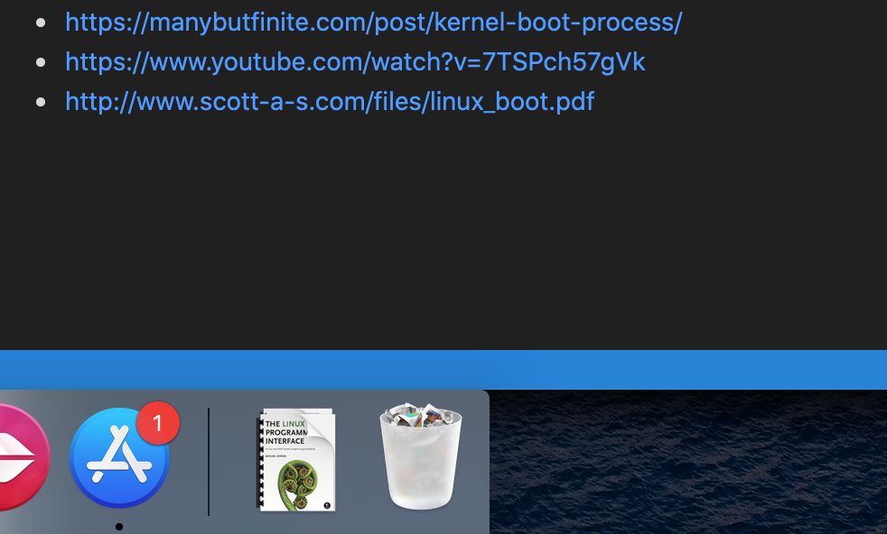

What happens when you press the power-on button?


# Steps

1. Power on
2. Motherboard initializes its own firmware. Initialises
3. Check if the CPU is present or not. If not, depending on MB you will get a beep or just a system with running fan!
4. On a multicore or a multicpu system one of the ramdom CPU is assigned as Boot Strap Processor. Rest CPU's remain inactive until Kernel activates them (See later)
5. The BSP runs in real mode. Real mode is where the CPU access the real memory and not virtual. In Real mode only 1 MB of memory can be accesses. 

``` Why?: 8086 had 20 PIN's hence it can address 2^20=1048576 = 1048575 locations or bit = 1 MB. 
However, the registers in 8086 were 16 bit. Hence, it can access 2^16= 64 KB of memory.
To handle this, memory segmentation was used: Memory divided into 64 KB segments. 
The physical address is calculated as: segmentNumber * 16 + offset

```
6. In realmode, the CS and IP registers of CPU's are used to calculate the reset vector location in memory. This is 16 bytes below 4 GB.


```
------------- $GB
JUMP to 960 KB mark
-------------16 Bytes below 4GB <--RESET VECTOR

Memory not accesible in real mode

-------------1 MB
BIOS
-------------960KB
Extended BIOS
-------------896KB
Expansion Slots
-------------768KB
Legacy Video card
mem access
-------------640KB
Accessible RAM

------------- 0


```

8. CPU executes the instruction at the REST VECTOR and JUMP to BIOS Code which is at 960 KB mark in memory. This code is copied from the BIOS (ROM) chip when the system starts. This is done as RAM is faster that BIOS ROM.

9. CPU starts executing BIOS code. It does POST: Checks Video Card, RAM, Keyboard.

10. BIOS code then locates the booting device based on the priority set in CMOS.

11. It checks the boot device as the priority set.

12. For the selected device, it reads the 0th sector of the disk. A disk is divides into sectors(pie shape) each of size 512 bytes. The 0th sector is called as MBR which looks as below

```
|code:boot.img | disk signature | Nulls | patition table four 16 byte entries | MBR Signature|
  440bytes           4 bytes      2by
```

## Stage 1
13. The BIOS executes the boot.img which is GRUB stage 1. boot.img then loads the diskboot.img which is stored in the first 30 KB right after the MBR on the disk. All of this happen in the first 640KB of the memory.

 It also copies the kernel right after the 1 MB mark. The kernel is a compressed image of 1.7 MB. However, the boot loader is still in real mode and we are accessing more than 1 MB of memory. For this, the CPU runs in unreal mode. The GRUB does this transition and ultimately leaves the CPU in real mode.

## Stage  1.5

14. The diskboot.img is called as core.img. This is also called as real mode kernel. This is where the grub.conf is read and the menu is show.

## Stage 2 - Kernel initialization
When the user selects the kernel to be loaded following happens:

```
The arch/x86/boot/header.S is executed 
    which calls main.c
        main.c has go_to_protected_mode  function.

        which first does:
            Setup_idt() --> temporary interrupt descriptor table
            setup_gdt() --> temporary global descriptor table

            Transitions to protected mode.
```
Then decompresses the kernel. It is overwritten to the the location above 1 MB.


15. At this point you have the kernel image loaded which uncompressed after 1 MB mark in protected mode.



16. Initializes, mouse, keyboard, memory: Builds paging table, starts paging, 

17. Loads the /boot/initrd.img which has loadable kernel models for LVM, RAID, NFS etc. It is initial RAM disk,.

18. The initrd.img is load uncompressed in contains /etc /lib/ /lib64. This serves as temporary root file systems.

19. Kernel then executes pivot_root. This mounts the actual file system as per /etc/fstab using the libraries from the initrd.img

20. Kernel then initialize scheduler. This is PID 0


21. Then it forks and executes /sbin/init. 
    ```
    Runlevels have been replaces with systemd :
    RUNLEVELS                   TARGET SCRIPTS
    0: poweroff                 poweroff.target
    1: Rescue                   rescure.target
    2: Multi-user(no nw)        multiuser.target
    3. Multi-user                   "
    4. un-used                      "
    5. Graphical                graphical.target
    6. Reboot                   reboot.target

    Each target file depends on bunch of other target file

    systemctl list-dependencies graphical.target will show all the dependencies

    ```
22. Then the kernel moves to background.


# References

- https://0xax.gitbook.io/linux-insides/summary/booting/linux-bootstrap-1
- https://manybutfinite.com/post/how-computers-boot-up/
- https://manybutfinite.com/post/kernel-boot-process/
- https://www.youtube.com/watch?v=7TSPch57gVk
- http://www.scott-a-s.com/files/linux_boot.pdf