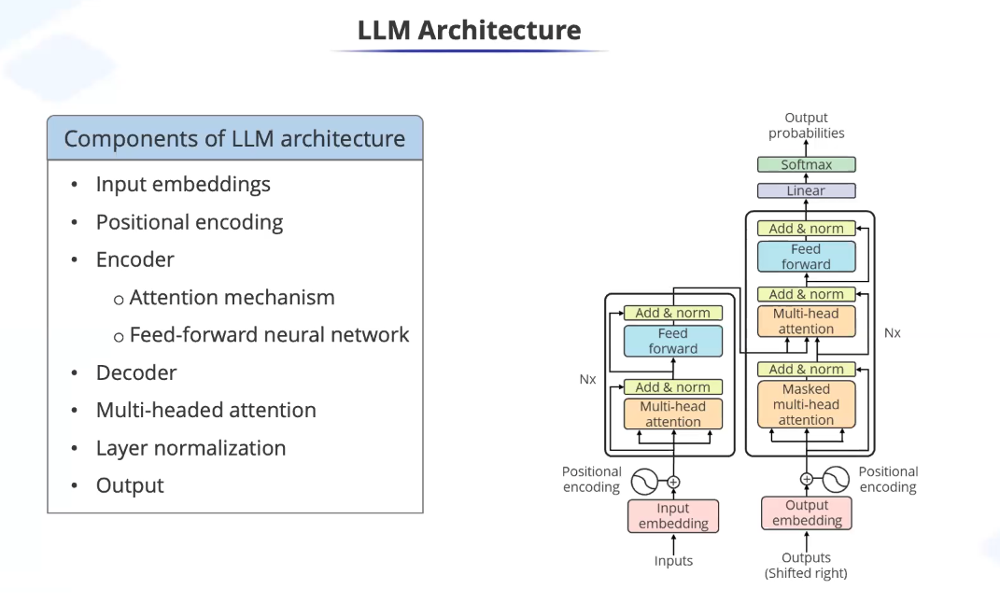
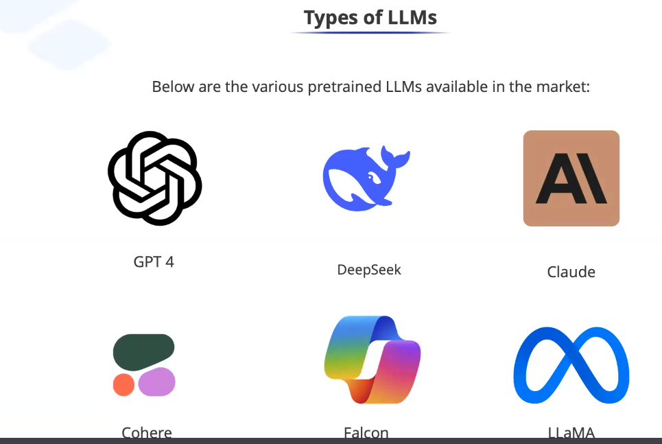
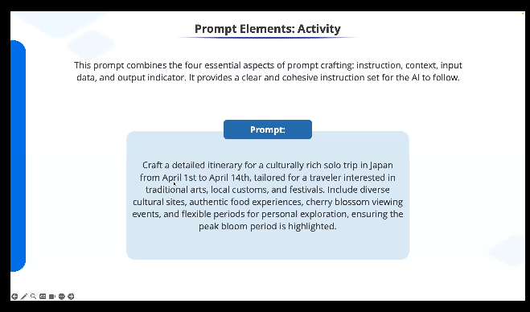
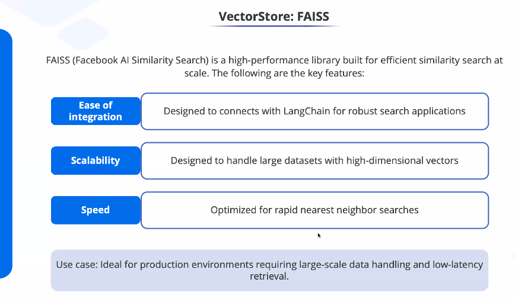

## Artifical Intelligence
- It is a field that develops a systems that mimics human intelligence
- Machine learning is a specialized field within AI that develops algorithms that allows computers to learn and predict from data
- Deep Learning is a specilized area within maching learning that utilizes neural networks which have many layers to analyze data ( facilitate machine learning)

Thus Deep Learning --> is a type of maching learning technique --> which leverages neural networks which are of types:
- Feed forward neural networks
- Convulutional Neural Networks : Used for image processing
- Recurrent Neural Networks: Used in speech recognition tech.
- Autoencoders: Used for anamoly detections, unsupervised learning and data compression

- Transformers

## Transformers
- Transformers used self attention mechanism. It is used by models like:
GPT
BERT
T5
Self attention mechanism evaluates the entered text in parallel and understands the context. Example: I am not feeling well vs kids threw a coin in well. Here well has different meaning and using self attention mechanism various transform based models. 
Another use is in language translation. 

These have revolutionalize NLP (Natural Launguage processing)

Generative AI leverages transfromer based arch. The models such as GPT and BERT are examples of Gen AI Model leveraging Transfromers

### Training Gen Models:
- The models is exposed to massive dataset and it involves optimixing set of parameters through back propagation which takes significant amount of resources.

- After training the model can generate contect by sampling for its learned data. Sampling temperature is key parameter while training the model.

#### Fine tuning
- 

# Large Language models

LLM are generative AI systems which uses transformer neural networks that use self Attention mechanism to perform NLP tasks.
 NLP is capability for machines to understand and generate human launguate. It helps to do:
 1. Machine translation
 2. Speech Reconginition
 3. Setiment analysis (tweets etc.)
 4. Chatbots
 5. Text summarizaqtion
 6. Text generation and correction.

 Type of NLP models
 - rule based systems: spam detection system 
 - Statistical models: 

## Working of LLM:

1. Tokenization: Text is splits in to smaller units Called tokens for processing
2. Embedding: Convert the tokesn into numerical vectors to capture the measning and relationship
3. Processing with transformers: Then the text is analyzed using self attentions
4. Generate Output: Predicting and constructing text based on learned patterns
5. Fine tuning and adaptation: Customizing LLMB for specific tasks

Example:

When you give input text:

### LLM Architecture

# Prompt Engineering
- PromptIng is crucial aspect when you interact or build an LLM application.
- Minor improVements in prompting helps tremedously to improvent the outcome

- AI LLM is like a small kid, the more clear instructions you provide the more efficient it its.

## Basic Prompts
- Rather than saying : Ocean is... , one can say, complete the sentence: Ocean is.
- So you will see here the difference int he output based on minor adjustments

- Same model for Same question can give different answers.

### Elements of Prompt
- Instructions: Instruction is specific task or directive provide to the Model. Example: Create a japan itinerary for cherry blosson Season highliting culrural sires, local good and blosson events

- Context: You provide additional information the suppliements the prompt used to enhance the models understaing and refine its responses. Example, you Can add this: The journey is a solo adventure centered around culrural immersions, including participations in clocal festivals and tradinals workshops. Or you can say, this is a family journey with a 6 and 10 year old.

- Input Data: You can provide additional information: The individual will be in Japan from April 1st to April 14th, interested in arts and seeking to participate in local customes and festivals. You can also store the input data in databases such as vector database.

- Output Indicator: The Output indicator specifies the expected type or formt of the models output ans sets the criteria for evaluation the relevance and correctness of the responses. Example: The itinerary should offer a blend of scheduled cultural activities, oppotunieis for improptu enagements  with local traditions and free periods of personal exploration with a clear indication of when the cherry blossons will be in full bloom. or you can say it should be in tablular format

example of a good prompt:

## Advanced Prompt Enginering
### LLM settings
#### Temperature
    - Temperature: Sets the predictibility of the models
    - Lower values example 0.2-0.3 _ More predicatble and focused out puts
    - Higher Values 0.7-0.9: More Varies and creative responses

#### Top_p : controls the breadth of the models responses, lower value increases precision and higher value enhances diversity.

    - Lower the value: 0.2 concise Information
    - higher valuse: 0.9 broader more varied output

# Zero Shot Prompting
- Zero shot proMpting involves presenting a model with a propt or tasks which it has not been trained on. Example: 
- Zero shot proMpting involves presenting a model with a propt or tasks which it has not been trained on. Example: 

# Few Shots prOpting

## VectorStore

- It acts as a storage space for embeddings which helps with quickly find and work with the data representations which improves models performance

- In LangChain VectoreStore is and abstract class that represents a store of vectors
- There are different implementation of vectoreDatabase

- FAISS: Facebook AI Similarity Serach is a hight performatn libararry built for efficient similiaralty search at scale

- Pinecone: Fully manages cloud-native vectore database that ensures high availablit and global indexing. Not free and works with langchain

- ChromaDB: Can be installed locally and is lightweight.

## How it works?
- You tokeize and then create embeddings which are stuctured formats. These can be stored in VectorStore using LangChain.

- Retrieving vector: The vectoreStore retrieves the embedding vectors that are similar to the embedded query.

