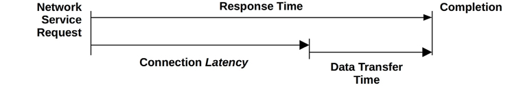

# Linux System Performance

## Key Terms

1. IOPS: Disk read and write per second
2. Throughput:
    - disk: data trafer rate
    - Network: Bytes transfered
    etc..

3. Response Time: Time for the operation to complete: Latency + execution Time

4. latency: Time spent waiting to be serviced.

5. Utilization: 
    1. Time based:
        - Disk:
        iostat -xm 2
        Show the utilization

        - CPU:
            top
            mpstat

    2. Capactity based
    - CPU: Load average

    - Disk:
        : df -h
    - Memory
        free -m
        vmstat
    - Network Utilization

6. Saturation: the degree to which a resource has queued work.
    - Disk: The 100% utilized disk will have higher queue length.
    - CPU: Load average.

    Generally, we a resource is 100% used, it is considered as saturated.

## Latency

HTTP GET

HTTP GET can be split into:
- DNS Latency
- TCP Connection Latency
- TCP data transfer Latency.

# Misc
- An application can perform bad either:
    - resource costraints
    - Or to much workload 

# Sytem Performance debugging methods

## USE
1. Identify resources
2. For all resources check:
    1. Erros
    2. Saturation
    3. Utilization.

3. Utilization beyond 60% is generally a problem.

## RED
1. Used typically for Services or rather service level
2. Here, applications Request rate, Error and Duration are used to see the issue with application.

## Workload char

Workloads can be characterized by answering the following
questions:
Who is causing the load? Process ID, user ID, remote IP address?
Why is the load being called? Code path, stack trace?
What are the load characteristics? IOPS, throughput, direction
(read/write), type? Include variance (standard deviation) where
appropriate.
How is the load changing over time? Is there a daily pattern?

- Stick to 5 whys

- Try to stop bleeding, always remember to ask what changed recently. 

- Thinkout loud!

- Dig deeper

- Troubleshooting steps: Come up with logical steps:
    - Examine, diagnosis( hypothesis potential cases when this can happen), test (what will you do to test.)

- Scripting:
    - Re-invent common language idons.
- Explain your thought process. Ask clarifying question.

# Kernel Parameters
sysctl -a | grep kernel

kernel.shmmax=maximum shared memory segment size in bytes. Ideally should be half of RAM (oracle recommendation)
kernle.shmall=maximum number of shared pages.

kernel.shmmni= minimun shared memory size which is the page_size.

kernel.hung_task_panic = 1 When a task is in D "hung" state 

kernel.softlockup_panic = 1
