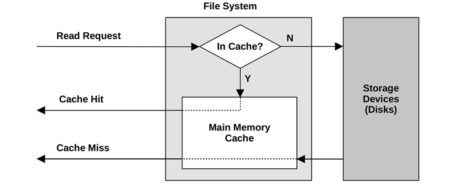
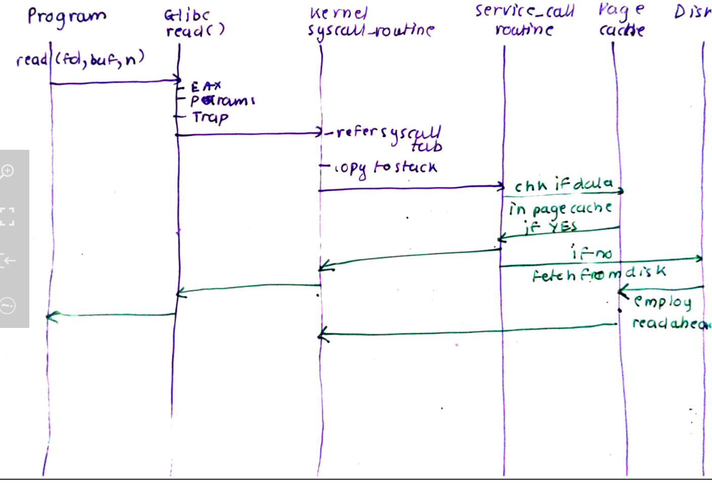
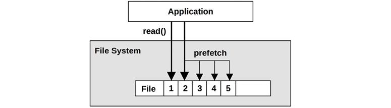
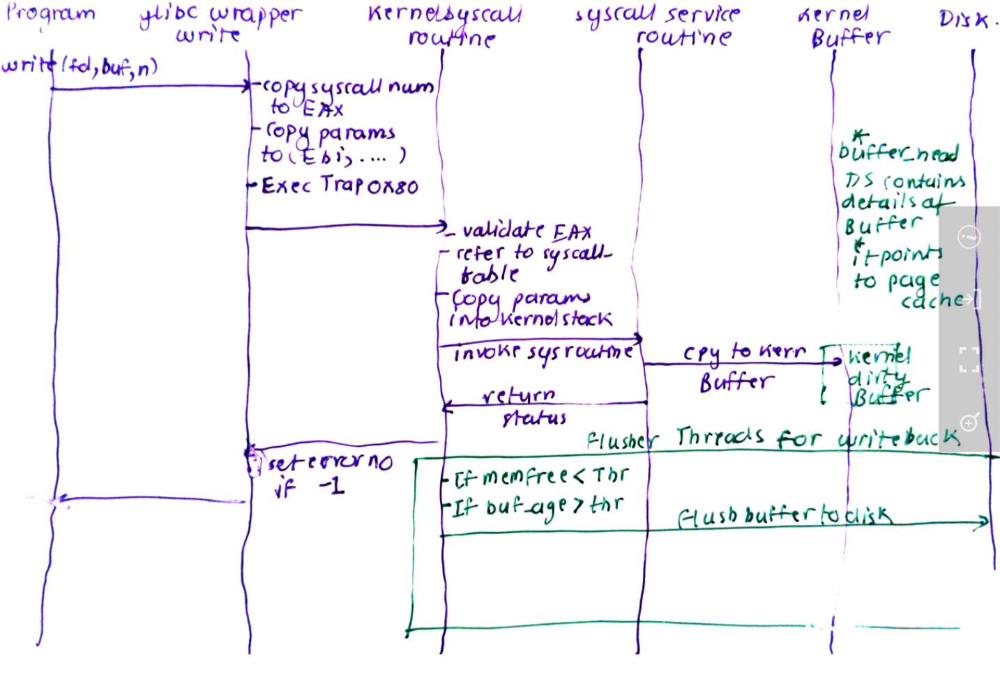
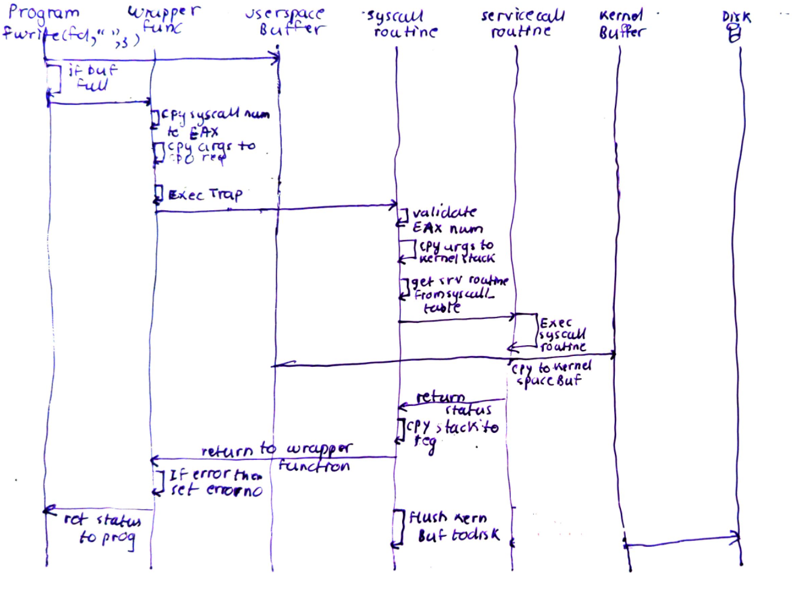
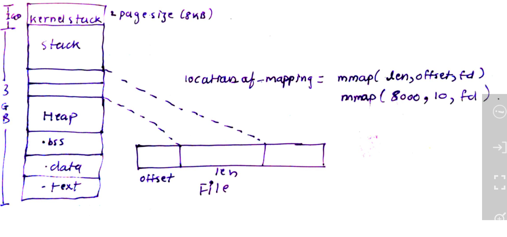

 A System Call is controlled entry point into kernel allowing processes to request kernel to perform some actions on process behalf. Kernel makes range of services (or types of syscalls) available to processes via system calls using system calls API. Examples:

- Process Examples: Fork(), exec(), execv()
- File I/O
- Network Sockets
- Signals
- IPC
- Terminals
- Threads
- I/O Devices


# Library Functions

- These are the wrapper functions which the C programs call for performing specific actions.
- Not all Lib Functions do system_calls(). Example, string manipulation functions does not do system_calls. Where as other like fopen(), fwrite() are directly layered on top of open() and write() system calls.

- GLIBC has all the standard library functions we use. LDD can be used to find version of LIBC in use.

- Program can be compiled:
    - statically linked: Copies the actual function code into .text sections
    - Dynamically linked: name of library or Reference is added to code. These are in ELF format


- Compilation steps:
    hello.c  ---> hello.i ---> hello.s(assembly) ----> hello.o(relocatable) ----> hello.out(executable program in ELF format)


- Errors from system calls are handled by the library functions. If the system call returns an error, the ERRORNO variable is set by systemcall. using perror() and stderror() function these value can be retrieved and error can be printed.

Usually the function would return -1 and then we can use ERRORNO to retrieve the actual error.

```

#include <stdio.h>

main() {
   FILE *fp;
   int c;

   fp = fopen("/tmp/testi.txt", "r");
   printf("%d",(int)fp);
   if (fp == NULL){
	perror("open");
   }

}

```

- Invoking a system call does a "mode switch" and user process is switched to kernel process.

- Systems calls can either:
    1. mode switch
    2. Context switch
    
# File I/O system calls

## basic I/O (Buffered at Kernel space level):

1. open(filename,flags,mode)
    - flags represent the mode of file to be open: 
    ```
    O_RDONLY
    O_WRONLY _> 
    O_CREAT -> If the name does not exist, create the file. If present do noting unless O_EXCL isused
    O_EXCL
    O_SYNC --> Do not buffer at kernel level
    O_NOBLOCK -->  Do not wait if no data is avail (example disk is waiting to read)
    ```
    open("somefile",O_CREAT|O_WRONLY|O_TRUNCATE)
    means create an new file in wronly mode and truncate it to size 0.
    Thisis equivalent to creat() system call.

    - mode: Permission to be placed on the file: rwxr-wr--

    - On success returns no-negative integer which is the smallest file descriptor available for the given process: usually it is 0 to 1024 but can be set.

    - On error returns -1 and set errorno variable. error can be retrieved using perror()


2. num_of_bytes_read_into_buff=read(fd,buffer,count_of_bytes)
    - fd is the file descriptor to read from, buffer is the buffer to read into, count_of_bytes is the max bytes to read.
    - returns -1 on error and sets errorno. On success returns the number of bytes read
    - returns 0 if EOF has been reached.
    - Read is always in blocking mode. That is if the file is not available to read, this call will wait until it becomes available.
    - -1 with EINTR is for blocking read when interrupt signal is received
    - -1 with EAGAIN is for non-blocking read when there is no data to read.

## Caching



- In order to improve read performance, FS uses cache.
- In order to improve write performance, FS uses buffer which are also in the page cache.


## Readahead or prefetch:





3. n_of_bytes_written=write(fd,buffer,count_of_bytes)

    - returns -1 of failure and sets ERRORNO.
    - Partial writes can happen and should be check by comparing n_of_bytes_written with count_of_bytes 
    
    Write() are not written to disk immediately. Kernel usually buffers them as shown below:

    

    ### Writeback
    - 
    - Kernel has flusher threads which flush the contents of dirty buffers to disk periodically. 
    - fsync() also forces kernel buffer to be flushed.

4. close(fd)
    - Returns -1 on error.

5. lseek(fd,offset,whence)
    - offset: number of bytes to move to
    - whence: base to move from: SEEK_CURR, SEEK_END etc

    ### Fileholes:
        - It is possible to write to arbitary location past the end of file. The space between the end of file and new location is called as hole. Core dump is example of sparsely populated files.

## Multiplexed I/O
- processes might need to read/write multiple file descriptors.
- This multiplexing is handled via poll() systemccall.
- poll() system call takes pollfd as struct which checks the file descriptors for events such as POLLIN (read) POLLOUT(write)

## User Buffered I/O
- Programs often issue many small I/O requests to files. Hence, user space buffering is employed rather asking kernel to buffer to avoid context switching.

- fread() and fwrite() systemcalls do not directly initiate disk access. Instead the data is copied between userspace buffer into kernel space buffer. Reasons:
    - Disks works in Logical blocks usually of 4K size.
    - Programs ofter work in chars and lines which might not be of same size.
    - Also, calling kernel to write/read to disk every time data is requested needs lots of context switches.


- Following diagram shows the process in detail:


- fwrite, fputs are stdio.h functions which provide buffered I/O. The size of the buffer can be changed and controlled using the setvbuffer() on the file descriptor.
    - setvbuff(fd,buff,mode,size)
        - where:
            - buff = buffer in memory
            - mode can be = _IONBF --> Do not buffer
                            _IOLBF --> Full buffer: Initiate write() system callwhen new line is encountered.
                            _IOBF- Block buffer,

- To force user user buffer, fflush() call can be used.

- kernel moves the buffer to disk whenenver it is full or if calls like fsync() are initiated. fsync() forces the kernels bufferes to be flused to disk.

- If a file is opened in O_SYNC mode, the every write() call results is flush call to disk.


- Here is the details syscall diagram for the same:




## Advanced I/O:

1. Scatter/Gather I/O or vectored I/O:
    - System call reads or writes from vector of buffers
    - readv() and writev()

    ```
    char buff1="someothing"
    char buff2="vin"


    iovec="buff1,buff2"

    writev(fd,iovec,size)
    ```

2. mmap() or memory mapped I/O / files:
    - mmaping is file by mapping disk block to a page in memory.
    - mmap take "len", "offset" and "fd" as argument. The data of size "len" is then mapped in to memory.
    - mmap() system call operates on pages. If then "len" is not multiples of page size then, the remaining mapped space is filled with zero's
    

    mmap to copy from one file to other:

    ```
    fd_in= open("input_file",readonly,perms)
    fd_out= open("input_file",readwrite, perms)
    
    src=mmap(sizeof_fdin,0,fd_in,PROTO_READ)
    dst=mmap(sizeof_fdin,0,fd_out,PROTO_READ|PROTO_WRITE)

    memcpy(src,dst)

    msync(dst)

    ```

    Anonymous mapping in memory:

    ```
    p = mmap (NULL,                   /* do not care where */
          getpagesize (),         /* map one page */
          PROT_READ | PROT_WRITE, /* map read/write */
          MAP_PRIVATE,            /* private mapping */
          fd,                     /* map /dev/zero */
          0);                
    ```
    - The data written to the memory is not immediately written to the disk. The OS takes care of moving it at a later stage.
3. mprotect() system call can be used to change the access mode of a given block of memory mapped by mmap() system call.

4. msync() call can be used for syncing back content of buffer to a mapped file.

5. readahed() system call provides mechanism to read n bytes of files into pagecache ahead of time.


# Stat family system calls

stat(file_path, stat_struct)
fstat(file_descriptor,stat_struct)
lstat(file_path, start_struct)

stat_struct is returned by the stat() syscall as below and is pulled from files inode table entry: 
This is same as that of ls -l fields 
```
struct stat {
        dev_t st_dev;         /* ID of device containing file */
        ino_t st_ino;         /* inode number */
        mode_t st_mode;       /* permissions */
        nlink_t st_nlink;     /* number of hard links */
        uid_t st_uid;         /* user ID of owner */
        gid_t st_gid;         /* group ID of owner */
        dev_t st_rdev;        /* device ID (if special file) */
        off_t st_size;        /* total size in bytes */
        blksize_t st_blksize; /* blocksize for filesystem I/O */
        blkcnt_t st_blocks;   /* number of blocks allocated */
        time_t st_atime;      /* last access time */
        time_t st_mtime;      /* last modification time */
        time_t st_ctime;      /* last status change time */
};
```
Note: Linux does not store creation time and ctime here is time when the meta data of the file was changed

# System calls for files

- chown(),lchown, fchown()
- getxattr(),lgetxattr(),fgetxattr() or list -> listxattr(),llist,flist
- getcwd()
- chdir(), fchdir()
- mkdir(), rmdir()
- link() --> hardlinks
- symlink()

There is NO SYSTEM call for copying. Refer to the mmap() code for copying file. Thats how cp does it.

- moving is done via rename()
- ioctl() : --> out of band connection. Eject CDROM ioctl(fd,CDROMEJECT,0)

- fd = inotify() and and inotirgy_add_watch(fd, path)