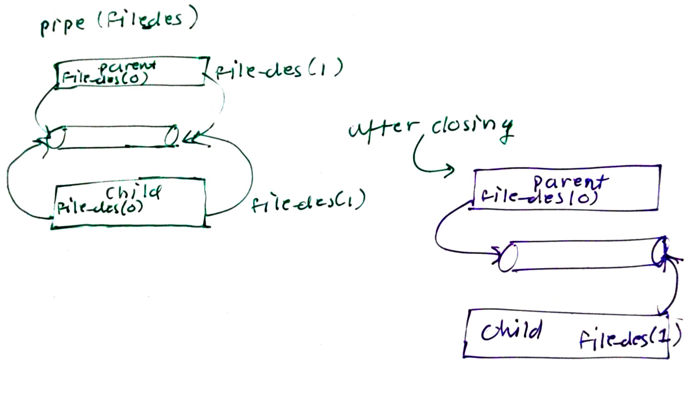

Inter Process communication provides mechanism for information sharing. Done in 3 ways:

1. Shared Memory
2. Message Passing
3. Signals.


# Shared Memory

- One process creates a shared memory in userspace. This memory can be accesses by other process. As all of this is done in userspace, no system calls are needed for sharing info. Except for creating the shared memory segment.

- shared_mem_id= shmget(key,size,flags) creates the share memory of size rounded by page size. A unique key is used

- shm_pointer=shmat(shared_memory_id,addr, flags) attaches the created shared memory to process user space. This is done in the region between stack and heap.

- now you can write to the shared memory like regular memory

    *s = "somedata"

- On the client side, we do shmget(key,size,) and then attached using shmat()


- The producer consumer problem described in threads in another example of shared memory.
## Limits
```
$ cd /proc/sys/kernel
$ cat shmmni -> Number of shared mem segments
4096
$ cat shmmax -> Max amount of shared memory allowed
33554432
$ cat shmall -> system wide limit on total number of pages allowed.
2097152
SHMSEG : Per propcess limit
```
## Disadvantages:
    - The processes need to device their own synch methods. Like use semaphor in prod-con problem.


# Message Passing

- In this shared memory is created in the Kernel space.
- system calls such as send and receive are used for communication
- Kernel manages the shared memory.


# Pipes
- Always used between parent and child
- It is unidiretional
- For two way communication, we will have to create two pipes: parent to child and child to parent.
- Pipes can also be used between siblings. This is how shell uses the pipe operator.
- Pipe work on byte stream. 

- steps:

```
int file_des[2]

pipe(file_des)

fork()
in child close file_des[0]

In parent start writing.

in child start reading
```



# FIFO

- FIFO are opened the same way as files. Thus, these can be used to communicate between two different processes.

- On Shell, we can use mkfifo <path> to create the FIFO pipe.
- mkfifo(path,mode) is the system call for the same.
- All file system calls: read()/write(), open(), close() work on fifo.
- Once you open(FIFO) in readonly then it locks untill other end is opened in writeonly. This ways synchronization is acheived.

- Fifo are used in tee command of linux
- FIFO are also called as named pipes in linux.
- 


