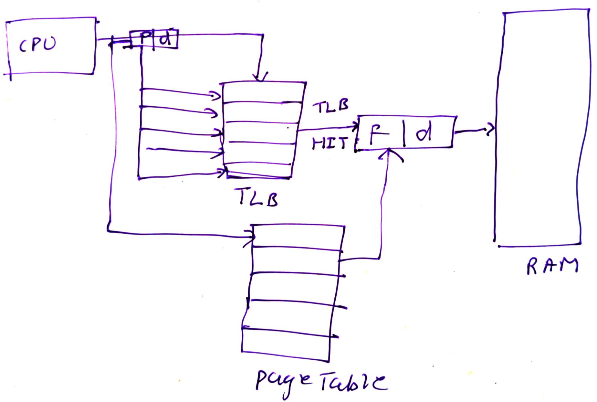
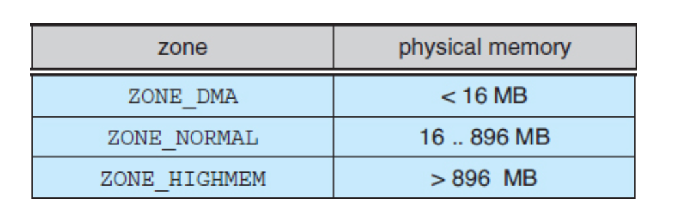
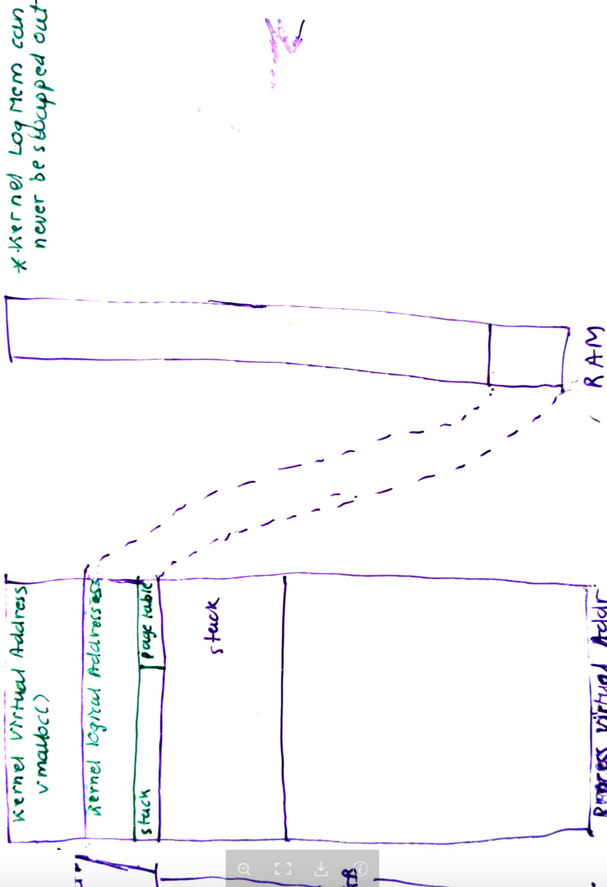
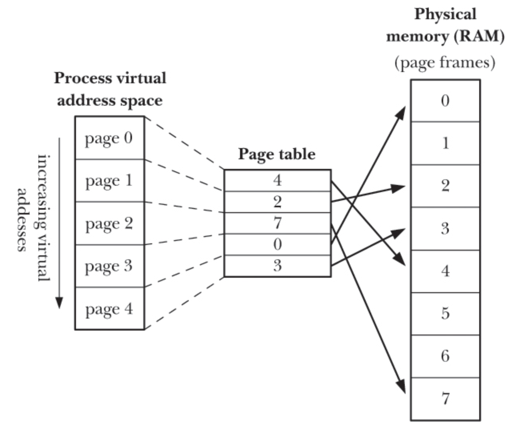

# Memory components
- Frames and pages: Logical memory in Linux is divided in to pages. In linux : getconf PAGESIZE
- The physal memory is divided into frames of equal size of page which is usually 4 KB.
- Page is the unit of memory it can work on usally 4 kb.
- Page frame is the page sized memory block again usually 4 KB. Kernel uses pfn to refer to physical page fram.

## TLB
- Translation Lookaside Buffer is a high speed memory which has key-value. 
- Key is the page number and value is the page frame, perms.
- It is very limited in size 32-1024 entries.

## Page table
- The TLB is limited in size. Thus, it cannot hold the memory mapping for all the processes.
- Kernel stores these memory mappings into page tables using struct_mm which is linked to process using task_struct (Process descriptor) 
- Page table maps a page to page frame.
- Each process has its own page table.
- A page table number:
    - maps to frame
    - valid/invalid
    - caching (cached or not)
    - permissions associated with a page.
    - bit indicating if the page is dirty or not. 
Working:
- When a process is loaded or when context switch happens the TLB is wiped out to avoid any conflict with old process.
- When CPU access a logical address, it contains page number and offset.
- It refers to TLB. 
- If TLB miss happens, then trap(interrupt) is generated and kernel specific IR Handler is invoked.
- This would then access the page table and returns to CPU.
- At the same time the TLB is updated.

## Thrashing:
    - For a low priority process, most of the pages would be swapped out to disk. 
    - Thus the process will not have enough frames in memory
    - Every page request will pagefault and the process is called as being thrashed.
    - To address this local page replacment is used where local related pages are all replaced in one go.

## Multi level paging
    - A 32 bit sytem will have 2^32 address space a
    nd a page size of 4KB = 2^12 would need 2^32/2^12 = 1 million = 4MB entries.
    - To reduce this, two level paging is used.
    - The logical address is divided into:
        outer page + inner page + offset

    - For 64 bit systems:
        global + outer + inner + offset

# Virtual Memory - Processes

- VMM maps virtual address space to physical address space
- VMM helps with efficient use of CPU and RAM(physical Memory) by making use of locality of reference:
    - Spatial Locality: Access memory near to recently accessed.
    - Temporal Locality: Access same memory which was accessed recently

- Memory used by program is split into fixed size units called *pages*. Corresponding RAM is divided into Page Frames of the same size usually of 4 KB. Only some pages of program need to be resident in the RAM page frames. Unused pages are swapped. If a page is referenced that is not in RAM page fault occurs. Kernel loads this from disk.

- Kernel maintains page table for each process in the kernel address space of the process. This is not accessible to the process but is used by kernel. Thus the processes virtual address space which consists of pages (of size 4k) are mapped to corresponding Page Frame in RAM via page table:

- Processes are isolated from each other and memory is not shared unless explicitly done using mmap().

- As this is virtual, memory can be moved.

# Another explanation

Does two things:
1. RAM size is fixed. Lets say 8GB. VM helps to fit large size process into memory
2. It also provides illusion for multiple process into RAM.
- Not all pages allocated to a process are allocated when the process is loaded.
- This is called as lazy allocation.
- So when a process is forked or execed, it is allocate task_struct from slab.
- Then mm field is set which is of fix size for 32 bit systems.
- The the pgd mapping are created for data which actually needed.
- When a process tries to access a some data this will happen:
    - 

A process lifecyle:
1. Program is compiled into ELF format.
2. ELF contains sections (.text,.bss etc.). ELF file contains the start and end of each section in memory map.
3. These section size are in multiple of page size.
4. The ELF header specifies all the details such as program entry point etc.
5. When we run program in shell, it will first fork the process. Fork is exact copy of program including its current memory map and file descriptor table.
6. Upon fork the kernel will allocate task_struct from slab.
7. Kernel employs COW, hence, only the memory map table is copied.
8. Now kernel immediately does an execve.
9. This is where a new mm is create and pointed for this is stored in the task_struct.
10. From the ELF header, using the PT_LOAD, the programs, data, text and bss sections are loaded in multiples of page size. For BSS zero filled pages are stored.
11. This is where the page table of the process is updated. In the page table, a given page is referenced against the page frame. Free frames are taken from the frame table.
12. Now the ELF section corresponding to the dynamic library on the _start of process is loaded into pages.
13. Finally instruction at the _start is executed.

# Zone
- Linux partitions the physical memory into zones. This is a logical mapping and not physical. There are three type of zones on 32 bit system:

1. Zone DMA: The first 16 MB of physical memory.
2. Zone normal: 16 MB to 896 MB
3. Zone highmem: remaining.

- The primary physical memory manager of linux is page allocator which uses buddy system.
- Each of the zones has its own page allocator and keeps track of physical frames. Here, as requested, the pages are either group to form buddy heap or split to smallest page_size.
- Example, when device driver request for memory, it is from zome_DMA.

## MMU
- MMU does the mapping or translation of virtual to physical. Part of CPU.
- MMU has TLB which holds:
    1. virtual to physical addres
    2. Permission bits

- 
- PageFaults as execptions raised when:
    1. If process is accessing a non-mapped virtual address.
    2. Process is trying to access memory when they do not have permissions
    3. The page has been swapped out to disk.

- Diagram below show the per-process virtual memory layout.
    - Kernel Logical Addresses:
        - Use fixed memory mapping and just like virtual space are physically contiguous. Thus can be used for DMA.
        - These cannot be swapped out. kmalloc is used to allocate it.

    - Kernel Virtual Adresses:
        - There are no virtual addresses. And it is usally the reserved space of top of RAM.
        - vmalloc() is used to allocate this.
        - Non-contiguos

    - User virtual Addresses:
        - 3 GB of space on 32 bit systems.
        - Uses MMU
        - Can be swapped out.
        - Each processes has got its own memory map or page table which is part of kernel stack of that process.

    - Lazy allocation:
        - Kernel does not allocate physical memory immediately.
        - It allocates virtual memory but does not allocate physical memory until the process actually touches it.

# Kernel Memory allocation

Kernel memory allocation is used differently than the user space because:
    - Kernel datastructure are of different size or varying size. 
    - Pages/memory allocated to kernel needs to be physically contiguous for DMA.

Following are the ways kernel allocates memory to itself:

1. Kmalloc()- variable length allocator
2. slab allocator
3. page cache

## Kmalloc
- For arbitary size requests, kernel provides kmalloc() to allocate.
- Page of page_size are allocated but then split as required.
- Memory regions by kmalloc() are allocated permanently.

## Page cache
- Main cache for files and is I/O is performed via these.
- 

## Slab layer
- Slab allocation is a strategy to allocate memory for kernel.
- Kernel needs to allocate and deallocate data structure such as task_struct, inodes, semaphore, struct mm, pages etc.

- The slab layer is divided into groups called as caches each storing different type of objects. Example: There is a slab cache for process descriptor (task_struct)
- Each cache/group is further divided into slabs made of physically contiguous pages. Thus, each cache can contain multiple slabs.
- Each slab thus stores the data structures it has and can be in the following states:
    - full, partial or empty.
- Another example of cache is inode cache which would be made of multiple slabs (made of page or pages) containig inode struct. Here inode is called as object.
- Example of slabs using task_struct:
    - during kernel initialization, a cache for task_struct is created and number of objects are created in the cache which are marked as free.
    - when fork() system call is made, a new task_struct is allocated from this cache.
    - After the process dies, this task_struct is returned to cache.

Benefits:
- No wastage due to fragmentation. Remember kernel DS are of variying size and a single page size wount work.
- Fast as the free object are already allocated in slab of each cache.

## Kernel virtual memory
- Some region in the processes virtual memory is mapped for the kernel. This is not visible to the the user process.

- It can be divided into:
    - Kernel Logical Addresses:
        - kernel stack
        - page table
        - DMA resides
        - kmalloc()
    - Kernel virtual address
        - vmalloc()
        - This is general purpose

# Swapping
- When you are low on memory:
    - Kernel tries to find free frame.
    - If no free frame, then find a Victim Frame.
        - Here LRU/FIFO algo can be used.
        - if the selected frame is dirty, we know that its content from disk has changed.
        - Then we move it to disk by copying it and update the TLB and pagetable
        - Else, if the frame/page is not dirty then, it is not modified since it was read from disk. Hence just replace it with new page/data from disk.
        - Again update the pagetable and tlb. In page table we update the valid/invalid field.

- When the process tries to access the page (which is mapped to frame), page fault occurs and does this:
    - Put process in sleep
    - copy frame from disk to RAM
    - fix the page table to point to correct 
    - wake the process back up.

