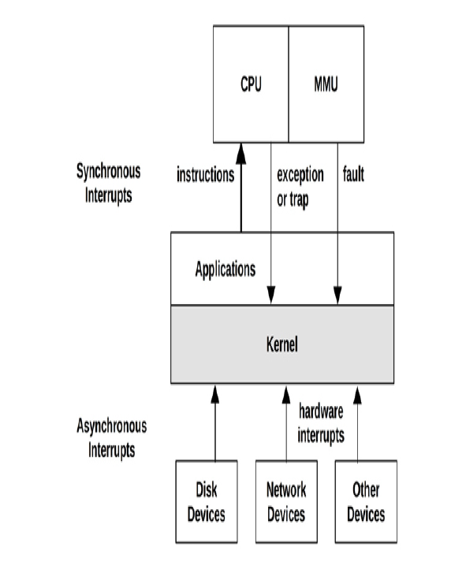
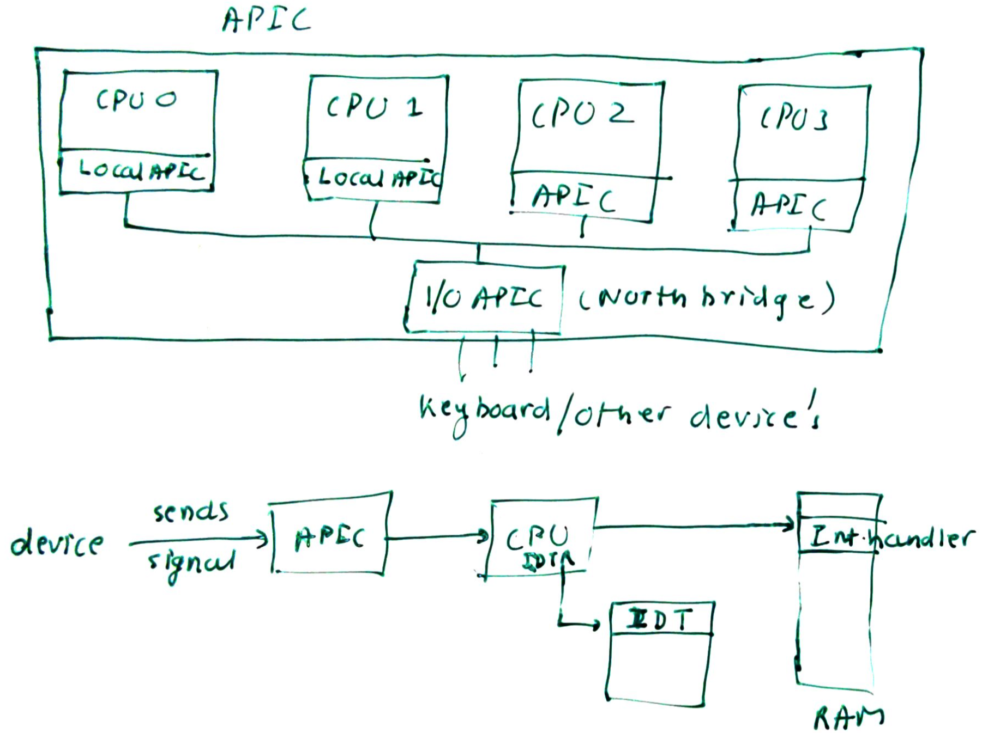
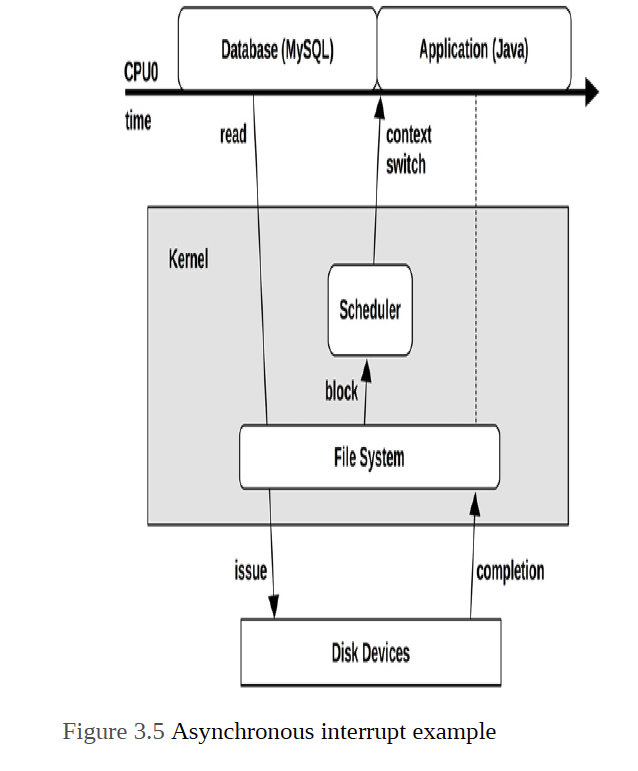

Interrupts are signals to the processors that some event has occured that needs to be processed. Upon being interrupted, CPU has to let got its current task and handle the interrupt.

# Types of interrupts
1. Synchronus interrupts often caused by Softwares
2. Asynchronus interrupts




# Async Interrupts- How hardware interrupts are handled
Examples of hardware interrupts include:
1. Disk devices signaling the completion of disk I/O
2. Hardware indicating a failure condition
3. Network interfaces signaling the arrival of a packet
4. Input devices: keyboard and mouse input

Interrupts are async which can happen any time by any hardware. Hardware interrupts are electrical signals which are sent to the Interrupt controller also called as I/O APIC. 

I/O Apic then multiplexes this to a specific CPU. Each CPU has local APIC. Thus, I/O APIC routes it to a single CPU. CPU then notifies the kernel of Interrupt. OS then handles the interrupt.

Each device gets a unique interrupt number to identify itself. This is know as IRQ number. 

When a device raises interrupt, its IRQ number is sent to processor via the I/O APIC.

RAM Store IDT which has 256 entries. The location of the IDT is stored in processor register know as IDTR (Interrupt Descriptor Table Register)

The IDT has mapping of IRQ number to interrupt handler routine or Interrupt Handler or Interrupt Service routine which is part fo device driver.

Interrupt handler is the function in kernel code that executes when an interrupt is raised.





## Example of Asyn interrupts



# Synchronous interrupts: Software

- Generally caused by softwares. Example, when a application makes a system call, "TRAP" interrupt is made using the "int 0x80" instruction.
- Faluts: Such as page faults.

# Top halves and bottom halves

Network card flow:

## Top Halve
1. Network card receives packet. Depending on the buffer, then generate and interrupt to processor so that they can hand over the packets.

2. Processor interrupts the existing running process.
3. Invokes the IR Handler for network card.
3. The IR Handler acknowledges to the hardware and then copies the packets from network card into the memory.
4. Readies the network card to receive more packets.
This runs with IRQF_DISABLED flag. Thus needs to be very quick and efficient as this is essentially disabling all other interrupts.
5. The top halve uses spin lock (cannot use semaphore as it sleeps) when entering a critical region with IRQF_DISABLED.
6. Top half runs with interrupts disabled as it is using spin_lock()

## Bottom halve
1. The rest of the interrupt handler code is responsible to perform work on the packets copies into the memory. This is the bulk of the work.

2. The device driver author decides what goes in top halve and what in bottom.

3. The bottom halves can be implemented in 3 ways:
    - Softirqs: These are used for time critical component: Used only for block device and network devices.
    - Tasklets: They are implemented on top of softirg
    - Workqueues: Kernel threads.

4. Bottom halves run with interrupts and when the kernel is executing the bottom half it is said to be in interrupt context.

# Device drivers

- IR Handlers are managed by the drivers. Each device has a driver and the driver needs to register IR handler into the kernel. Done using request_irq()
- While registering IR Handler following flags can be passed. These flags also tell the type IR Handler
    - IRQF_DISABLED: Not used often. This is used to disable all other interrupts when this interrupt is running.
    - IRQF_TIMER: This is set for handlers handling timer specific jobs.
    - IRQF_SHARED: This specifies that the interrupt line can be shared.

# Interrupt Context
- When kernel is executing the IR Handler code kernel is said to be in interrupt context ( Just like process context for kernel executing system calls)

- Incase of process context the "Current" macro point to the current running task. In this case it is not used.

- Interrupt context are time-critical because interrupt handler interrupts other code. Thus the IR Handler should be fast and efficient.

- When processor interrupts and executing process, it save the current process context in the kernel stack of the process. It also shared the kernel stack of the process which is only 2 pages (8KB) in size.


# /proc/interrupts

- procfs file systems is virtual filesystem that exists only in kernel memory and mounted on /proc.
- Reading and writing to /proc invokes kernel functions.
- /proc/interrupts

```
root@vinlok-ThinkPad-T400:~# cat /proc/interrupts
           CPU0       CPU1
  0:   90338710          0   IO-APIC   2-edge      timer
  1:        717          0   IO-APIC   1-edge      i8042
  8:          0          1   IO-APIC   8-edge      rtc0
  9:     153803       2824   IO-APIC   9-fasteoi   acpi
 12:       2056      22008   IO-APIC  12-edge      i8042
 16:     102915       4937   IO-APIC  16-fasteoi   uhci_hcd:usb6, yenta, i915
 17:         10          0   IO-APIC  17-fasteoi   uhci_hcd:usb7, firewire_ohci
 18:         60         35   IO-APIC  18-fasteoi   ata_generic, uhci_hcd:usb8
 19:          8          2   IO-APIC  19-fasteoi   ehci_hcd:usb2
 20:          0          0   IO-APIC  20-fasteoi   uhci_hcd:usb3
 21:        995        293   IO-APIC  21-fasteoi   uhci_hcd:usb4
 22:          0          0   IO-APIC  22-fasteoi   uhci_hcd:usb5
 23:        119          0   IO-APIC  23-fasteoi   ehci_hcd:usb1, i801_smbus
 24:         15          0   PCI-MSI 16384-edge      PCIe PME, pciehp
 25:          0          0   PCI-MSI 458752-edge      PCIe PME, pciehp
 26:          0          0   PCI-MSI 460800-edge      PCIe PME, pciehp
 27:          0          0   PCI-MSI 464896-edge      PCIe PME, pciehp
 28:          1          0   PCI-MSI 466944-edge      PCIe PME, pciehp
 29:          0         99   PCI-MSI 49152-edge      mei_me
 30:     373982     970626   PCI-MSI 512000-edge      ahci[0000:00:1f.2]
 31:          0         86   PCI-MSI 442368-edge      snd_hda_intel:card0
 32:   13326174   19909816   PCI-MSI 1572864-edge      iwlwifi

 ```

 # Enabling and disabling Interrupt 

 - Interrupts can be enabled or disabled for a given processor
 - or for a given line.
 - this is done to protect code from getting interrupted when in critical_section.

