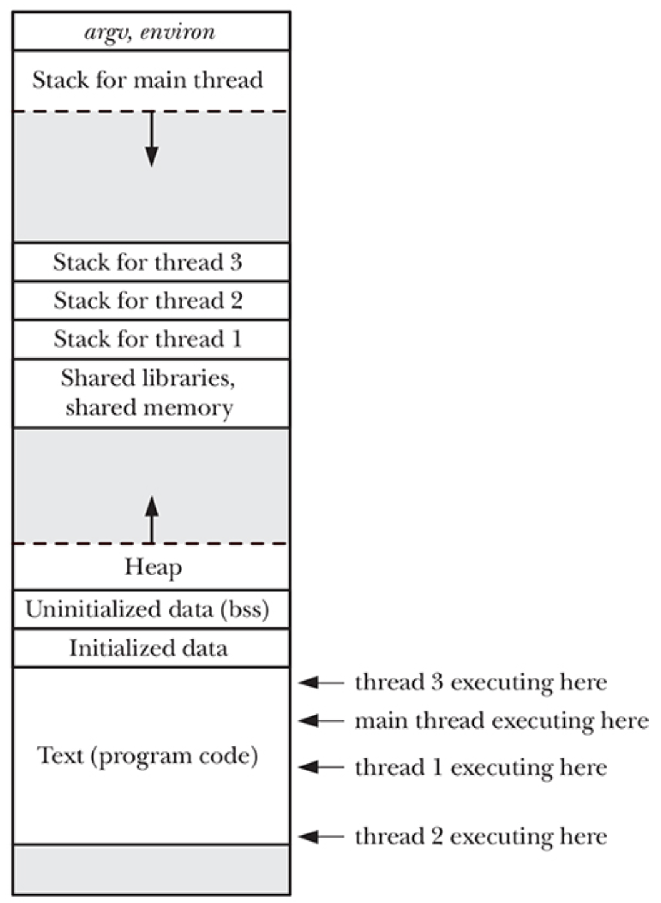
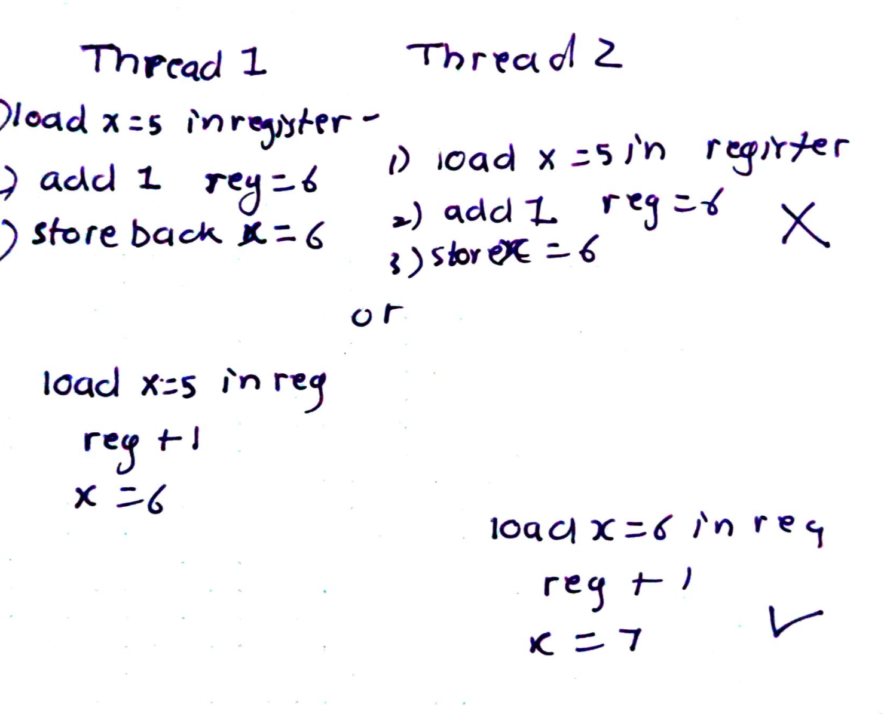
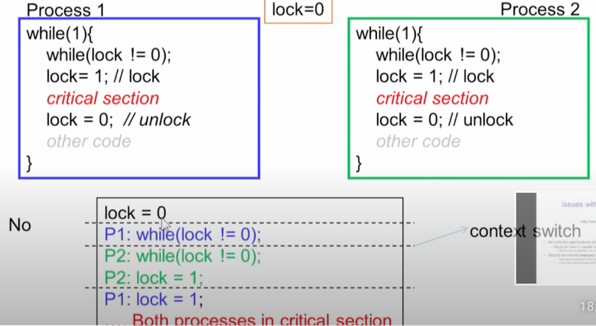

- If a process contains single thread, it is called single threaded else, multi threaded.

- Virtual memory is associated with process but not threads.
- Virtualized processor is available to threads and not to processes.


# Why Multithreading?   

- Style of programing or programming preference.
- parallelism
- Task delegation: Example: part of program which waits for use input can be delegated to a thread whereas other part can continue executing.
- Low context switching between threads as VMM is same.
- Forking processes are not expensive due to COW but threads are cheaper!
- Threads share the global memory, including .data, .bss, and heap. They only get the own stack.



- Threads provide a mechanism that permits an applciation to perform multiple tasks concurrently as they can execute on multiple CPU's

- As memory (heap,data,bss) is shared IPC is simpler.

# Thread ID
- Each thread in process is uniquely identified by thread ID.

# Thread vs Process
- Do you need to share data? Use threads
- Race conditions need to be handled as the memory is shared. You can use Mutexes, Semaphores to handle this.


# Threading Models

Two types:
- Kernel level: Thread in kernel translates to user-space concept of thread
- User-level threading: This is N:1 threading. Threads are only implemented in userspace and kernel is not aware of it. Not good for modern hardware as we have multi cpu systems. These threads are scheduled by the user level libraries.

# Threading patterns

## Thread-per-connection
    - Unit of work gets its own thread. Example: webserver serving request, or connection gets its own thread.
    - Here the thread will run until the connection or request or unit of work is over.
    - Generally used in I/O. As I/O is blocking, the threads get blocked until it is available.
    - Apaches standard fork follows this.

## Event Driven Threading

    - For thread-per-connection approach, with thousands of connections we will need thousands of threads. This might be counter productive as generally if you have more threads that processors.
    - 


# Concurrency vs Parrellism

- Concurrency can happen on single CPU systems. Here multiple threads get executed concurrently.

- Parrellism: This is also called true parallelism needs multiple CPU. Here, two or more threads are actually run in parallel on multiple CPU's.

# Race conditions:
- Race conditions happen when two threads/processes are accessing the same shared resources and outcome is dependent on the scheduling of other.
- Example: Consider x++. This can be broken down into:
    1. Load value of x(5) in register 
    2. Increment the register value 5 by 1 = 6
    3. Store back the register value to = 6

    If two threads are working on this, then this might happen:



    Thus here, x++ becomes critical region code and needs to be handled.

- This can be solved using synchronization that is the critical region of the code must be done mutually exclusive.

Another example:



## Spinlocks
- The most common type of lock in linux kernel is spin_lock.
- Atmost one thread can hold a spin lock at a time.
- Terminology:
    - If a thread is trying to hold a lock which is already in use, it is called as contended.
    - The other thread hold is called as spins.

- In the above example, the checking of lock and setting lock was not atomic, hence, both process entered the critical section.

- This can be solved by using the atomic_t datatype linux provides. There are various procedure provides to modify this data type:

set_atomic()
add_atomic()

### How spinlock works:
1. Two functions are defined:
    acquire(lock):
        keep spining until the lock val is 0


    release(lock)
2. Process A tries to acquire lock.
    - Here if the lock is already taken by other process, it will keep spining thats why spin lock

3. Once process B has done its work then it releases it.

4. Now process A finally acquires the lock and sets it to 1.

Spin locks are used by interrupt handlers (top halves) with IRQF_DISABLED on that processors. If there is other thread (IR Handler) on other processor waiting or contending or spining for lock, it can acquire this locks after the thread on other cpu is done.

There are methods such as spin_lock_irq() and unlock which can be used in top halve.

For botton halves, spin_lock_bh() methods are used.

Disadvantages:
- Unnecessary CPU cycles wasted due to spining.
- Hence, it is not a good idea to hold spin locks for large duration. 


## Semaphores
- Semaphores are Linux sleeping locks. 
- When a task attempts to acquire a lock, rather than spin waiting, the semaphore puts it in wait_queue() and then puts the task in sleep()
- When the semaphore becomes available, one of the task is awakened and acquires the lock.

- Semaphores can be used for task which need to lock for longer duration unlike spinlocks which cannot be used.
- As there is overhead involved with wait_queue, sleep, wakeup, semaphore are not good for short locks.

- Semaphores cannot be used by interrupts as they sleep.
- Most of the time tasks in userspace need to sleep and semaphores are the best choice. Not often used in kernel code.
- Semaphore can be used by arbitary number of lock holders. This is called as count of semaphore.
- Semaphore with count one is called binary semaphore or also reffered as Mutex.

- There are many function set available for semaphores. POSIX ones include sem_open(), sem_wait(), sem_post
Usually the syntax is:
 wait()
 //critical section

 post()

 - in the producer consumer problem:
    - On the consumer:
        - you create prod semaphore sem_open(prod, 0)
        - you create cons semaphore with initial value 1 sem_open(cons, 1)
        - loop 
            - you go into wait on pro 
            - you consume
            - you post on cons
    
    - on the producer:
        - you go wait on cons
        - produce
        - you go post on prod


## Mutexes
- Mutexes are mutexes :). They are semaphore with count 1
- Locks are used to enforce mutual exclusions hence know as mutexes.
- It is same as spinlock, just that in the lock rather than spining, the process goes to sleep/STOP state.
- 

1. Two functions are defined:
    acquire(lock):
        if the lock is used lock==1
            goto to sleep
        else:
            lock= 1


    release(lock):
        wakeup(other process)
2. Process A tries to acquire lock.
    - Here if the lock is already taken by other process, it will keep spining thats why spin lock

3. Once process B has done its work then it releases it.

4. Now process A finally acquires the lock and sets it to 1.

- Steps:
    1. Locks is defined by programmer.
    2. It is acquired before entering a critical region.
    3. Lock can be held only by one thread at a time, thus, if in use, other thread has to wait.
    4. When done, release the lock and let other use it.


# Deadlock
- Deadlock is a condition when two threads are waiting for each other to finish.

- ABBA is an example of this:
    - Here Thread 1 gets its first mutex A and thread B gets its first mutex B
    - But when thread 1 tries to acquire its second mutex B and likewise thread B tries to acquire its mutex A, both have to wait!

## Deadlock prevention
    - hold and wait: Avoid process which are holding some resource to wait on other resource.
    - If a processes is holding and needs another, then it must release before acquiring.
    - 

# Pthreads : Linux threading implementation
 
- The new way is Native Posix Thread Library: It uses clone() system call and treats threads just as processes sharing some resources.

- The user level threads are scheduled by the user libraries and not by kernel.

- pthread API is user space and defined in pthread.h

```
#include <stdlib.h>
#include <stdio.h>
#include <pthread.h>

void * start_thread (void *message)
{
        printf ("%s\n", (const char *) message);
        return message;
}

int main (void)
{
        pthread_t thing1, thing2;
        const char *message1 = "Thing 1";
        const char *message2 = "Thing 2";

        /* Create two threads, each with a different message. */
        pthread_create (&thing1, NULL, start_thread, (void *) message1);
        pthread_create (&thing2, NULL, start_thread, (void *) message2);

        /*
         * Wait for the threads to exit. If we didn't join here,
         * we'd risk terminating this main thread before the
         * other two threads finished.
         */
        pthread_join (thing1, NULL);
        pthread_join (thing2, NULL);

        return 0;
}
```
- In Linux threads are implemented using clone() system call with special flags

# Kernel Threads

- These threads exists only in kernel space. Thus they do not have any mm pointers in there task_struct.
- tasks such as flush, ksoftirqd are handled by kernel threads.
- Kernel handles the scheduling of these threads
- The user space level threads scheduling is handled by the user space library.


# Linux synchronization
- Linux kernel used to be non-premtive. That is task running in kernel mode cannot be interrupted. That changed in 2.6.
- Linux kernel provides atomic_t as a data type with following methods:
    atomic_t counter;
    - atomic_set(&counter,5)
    - atomic_add(10, counter)
    - sub
    - inc
- Mutex_loc() and unlock()
