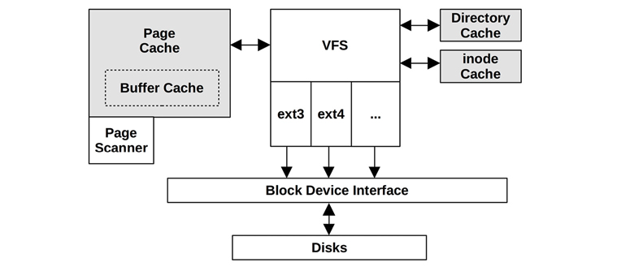
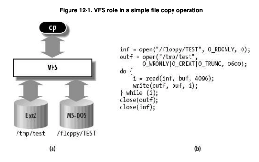

# /dev in Linux

- The dev files are connections but not containers. Thus they do not store any data.

- Some of the files present in /dev:

/dev/null (major 1, minor 3)
/dev/random
/dev/sda
/dev/zero (1,5)
/dev/tty: special char virtual console
/dev/full: write to this always return ENOSPC which signify that the device is full.

- Devices are represented on FS in /dev. mknod command can be used to create a /dev file.

- As /dev can get unmanagable with lots of devices, udev program is used to create the device in /dev. Kernel exposes information about devices plugged into this system using sysfs file system mounted on /sys. udev them parses this info based on the rules provided in /etc/udev/rules.d to create a dev file in /dev

- These file allow applications to interface with the device drivers.
- When an application performs opening, closing, reading, writing on device nodes or device file, kernel does not handle these as normal I/O but passes it to device drivers. Device drivers handle these requests.

- Except network devices, rest all devices have device nodes.
- Each of the device has got major and minor version associated with it. As the dev file do not store data, ls -li shows the major, minor version:

```
root@vinlok-ThinkPad-T400:~# ls -li /dev/sda*
352 brw-rw---- 1 root disk 8, 0 Oct 13 09:33 /dev/sda
353 brw-rw---- 1 root disk 8, 1 Oct 13 09:33 /dev/sda1
354 brw-rw---- 1 root disk 8, 2 Oct 13 09:33 /dev/sda2
355 brw-rw---- 1 root disk 8, 5 Oct 13 09:33 /dev/sda5
                        (major,minor)
```
- the major and minor number map to device driver loaded into kernel.
# Disks

Following picture shows a typical magnetic disk drive:


## How magnetic disk read/write

1. OS sends linear address of the logical block to be read. This is called LBA
2. Disk controller converts this to CHS address
3. Each CHS address maps to physical blocks on hard drives.

Thus to read data from disk it has:
1. seek head to specific track - Seek Latency
2. Rotate disk to specific sector - rotation latency
3. Copy the required blocks - transfer time


# File Systems
- Basic unit of allocating space in File System is called as logical Block. These are made up on multiple physical block(which are usually 512 bytes). Usual size of logical block is 4k (4096 bytes) = 8 physical blocks.

- Each logical block is pointed using a i-node pointer. 


## Linear view of disk


- boot block contains the stg2 loader. If you have multios then it is used, else not used.

- **Super Block** :
    - This is create during the FS creation: 
        mkfs.ext4 -j -b 4094 /dev/sda1
        At the end of the command you can see that it creates the inode table.

    - This sets the blocksize to 8192

    - tune2fs -l /dev/sda5

# I-node: Index Node
File system inode table is present after the super block. ls -li shows the i-node table with i-node number displayed as first field:

```
root@vinlok-ThinkPad-T400:~# ls -li
total 76
22806548 -rw-r--r-- 1 root root  1292 Oct 18 08:56 file_name

# Fields:

inode-num filetype ugo num-of-hardlinks userowner groupowner size in bytes and mod-ts

rwx
rws -> executable bit set and setuid/gid set
rwS -> exe not set and setuid set 
rwt -> sticky set and exec set for other
rwT -> sticky set and exec not set for other

ls -i also show the inode
```

It is a table with following details:
- dev where inode resides
- i-node number -> allocated sequentially
- file type -> - (regular), c, b, d (dir), s(socket), p(named pipe),
- user perms
- group perms
- other perms
- Three time stamps:
    1. mod timestamp (default shown by ls -l)
    2. access timestamp (ls -lu)
    3. last change to i-node info: ls -lc (Linux does not note creation time of file)
- number of hardlinks to the file
- file size
- number of physical blocks (512 size) allocated to the file
- Pointers to Data Blocks (logical blocks)
- preferred block size

stat() system call return stat struct with the above details except for the meta data.

# Extended Attributes for file
- Ext4 provides space in the files inode to store extended attribute. These attributes can be used for:
    - System ACL
    - Security suchas SeLinux
    - 

# VFS
- VFS is the abstraction layer provided by kernel for the user programs to make consistent api calls to FS. These calls are read(), write(),open(),lseek(),close(),m etc.
- It is a glue that enables system call such are open(), read(), write() to work regardless of filesystem underneath.

- VFS supports three types of file systems:
    1. Disk Based
    2. Network Based
    3. Specials FS such as /proc /tmp

- VFS has following objects types:
    - inode object: For disk based, this is copied from inode-table. This represents a spedific file
    - dentrie object: Directory entry mapping file-name to inode. This represents a directory
    - Subperblock object: Details of mounted FS. For disk based copied from disk. This represents a mounted FS
    - file object: only exists when the file is open. This is the Global Open FIle table.

- It is implemented in OOP fashion.




- As noted above, the VFS also caches the dentries and inode object thus making future operation to FS fast.


## VFS role in CP



## Dcache or dentry cache
- Caches the recently resolved path.
- Uses a doubly linked list to store the recent resolved paths. 
- Employs LRU.
- Also has a hash table to map path to node in order to improve the linked-list traversal.


# Special FS
- Network and File based systems are handled via VFS which helps to access the information stored outside of kernel. 
- Special FS such as /proc /pipefs  provide an easy way to manipulate DS of kernel.


## Journaling
- ext2 was not a journal FS. Incase of crash, you need to do fsck.
- ext3 onwards, xfs, reiserfs are jornalling. Like database redo logs, these maintain a journal file where all updated to the file are logged in unit of transaction before the actual update is made to the file.
- In even of crash, the journal is replayed recovering the FS very fast.

# Mounting a FS
- In linux, kernel mounts the / root filesytes. Rest of FS are mounted on top of this. When the system initializes, the mounting of / is done in two stages:

1. Mounts rootfs which provides empty directory which provide the mount points.
2. Then it mounts the real root FS over the empty dir.

- When a new FS is mounted, it is tracked using the vfsmount descriptor.


## fstab:
Format of fstab/mtab/ and /proc/mounts file is:
```
<file system> <mount point>   <type>  <options>       <dump>  <pass>
```

## tmpfs:

- Memory based VFS which used virtual memory(RAM + swap).

- command:
```
mount -t tmpfs newtmp /tmp
```

- Default can grow half size of RAM

# File and directory permissions

- File permissions are described in the ls -l output
- setuid/gid can be done and not for others.

# Directories

- Directories are files which contains mapping for filename to it's inode. Each entry is called as directory entry.

- The i-node entry 2 always stores the / directory file details. This way kernel know the starting point when resolving names.


- every directory has :
    - . pointer to itself
    - .. pointer to its parent

- Hard links are entries in directories pointing to the same inode entry.

```
ln target link_name
```
- i-node table keeps track of number of hard links (also shown by ls -l command). 
- rm command steps
1. removes it entry from the directory
2. decrements the link count by 1.
3. if the link count is 0, then deallocates the i-node and data block pointers.

- hard links cannot be across partitions.

- symbolic link or soft links is a special file which contains link to other file.
- The dcache is used to stored the already resolved path.

# Pathname Lookup


## directory perms:

- r -> list contents of directory
- w -> can create/add/delete files in directory.
- x -> Can access a file or search it. This is also referred to as search permissions.
    - example: if you have to access /tmp/x file, you need to have x permission on /tmp and then r permission on x file itself.

    - r-x: if you have r perms on dir and no x, then you can only list the files.
    - --x: If you only have x, then you can access the file if you know the full path and have access at file level.

### Algo used by kernel to check perms:

1. If privileged user give access
2. If uid matched give perms
3. If gid matches give perms
4. else, check for others.

### Sticky bit:
- Generally used on shared directories to prevent other users to delete files created by other.
```
drwxrwxrwt  18 root root       4096 Oct 19 07:38 tmp
```

# I/O scheduler

## Devices in Linux

- Two types:

1. charater- Terminals, keyboards. These cannot be accessed randomly. Thus keyboards device driver is of type c.

2. Block: Disks, usually work in blocks of 512 bytes. These are physical blocks
- The Logical Blocks Address (or logical blocks) map to CHS address.
- Disk seeks are 25 million times of one CPU cycle.
- can be accessed randomly.


- To avoid disk head moving hap hazardily I/O schedulers perform two mechanisms:

1. Merging: if there is a request for block number 4 and then there is another request for block 5-8, these requests are merged together into 1 as 4-8 and then submitted.

2. Sorting: Requests to blocks 23, 9 , 1 and 10 are sorted as 1,9,10,23. If a new request comes for block 5 it is inserted at correct place and sent. This way head moves in linear fashion.

## *Read latency* 
- When data is not present in page cache, it has to be read from the disk and then cache updated and then data given back to process. This blocks the process till the time data is fetched from disk which is lengthy operation and called as disk latency.

## *writes-starving-reads*

- Read operations are sequential. If data is read from file in chuncks, before reading the next chunk, the previous chunk needs to be done. Thus, we need to do Disk I/O 
- Writes on other hands do not depend on disk I/O as the write are written at some later stage and these requests are streamed. Thus writes can consume all of kernel time starving reads.

- As the requests to blocks are sorted by block numbers and served, it is possible that a given block is starved and served after long time. To avoid this, there are different schedulers:

1. Linus elevator scheduler: 
 - Sort blocks by number in sorted_queue = 1(r),10(r),11(w),15(r),30(w)
 - service one at the head of sorted_queue 30(w)
 - If any item is older than exptime of sorted_queue service it first.

    Too simple heuristic and was decom in 2.4

2. Deadline I/O scheduler: 
- Maintains 
    - sorted_queue by block number = 1(r),10(r),11(w),15(r),30(w)
    - read_fifo by submission times = 1(r),15(r),10(r)
    - write_fifo by sub times = 30(w),11(w)
- Serves from head of sorte_queue
- If oldest item expires, it serves from head of respective queue. Example if 1 has expired, head from read_fifo queue which is 10 will be served.

3. Anticipatory I/O scheduler
- Deadline scheduler has lot of switching between read and write FIFO queue.
- Generally reads are more than writes. 
- Serves requests as above algo, however, before moving to next requests, it sits ideal in anticipation that request near to a given block will be submitted

4. CFQ- Completely Fair Queuing:
- Each process gets its own queue and each queue is assigned a time slice.
- RR mechanism between queues are employed.
- If there are no requests in a given process queue, CFQ sits in that queue for 10 ms in anticipation that something will come. If not, move to next.

5. Noop: 
- Does only merging no sorting
- Used generally by SSD.

Optimizg for I/O performance:
- Peform block size aligned I/O
- User user space buffering (printf, fwrite stdio buffering)
- Schedule I/O in user space:
    - Sort by file path. If there are multiple requests made to files, generally files in the same directory will be closer. Hence, make the requests by sorting by file path

    - Sort by inode. inode of file can be figured out by inode.
    - soft by physical block:
        ```
        - get the blocks of file using stat()
        - get the physical blocks using ioctl()
        ```


# References:

- https://www.youtube.com/watch?v=N-rrmeP1O2g&list=PL7B2bn3G_wfBuJ_WtHADcXC44piWLRzr8&index=18