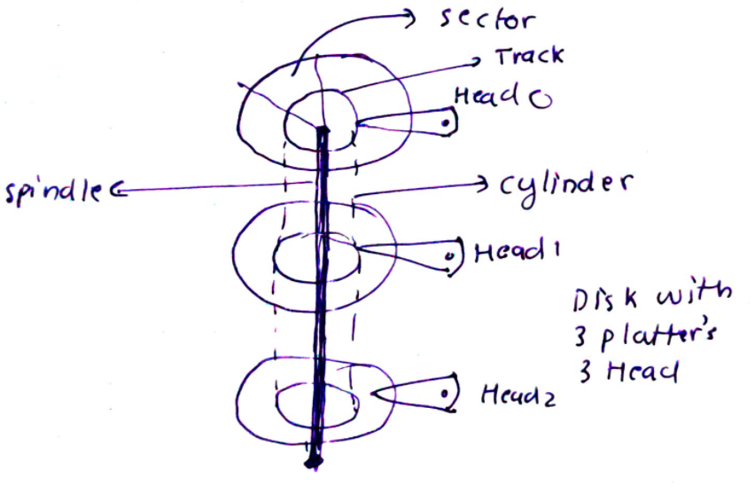
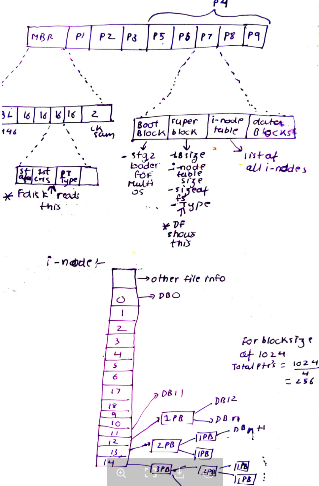
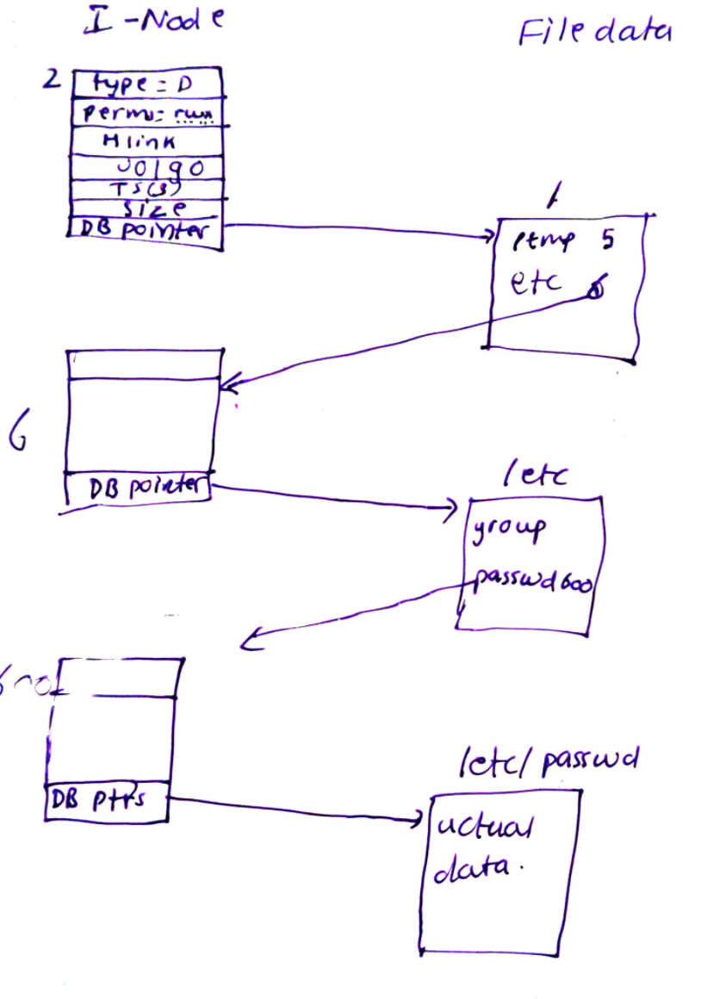

# Devices in Linux

- Two types:

1. charater- Terminals, keyboards

2. Block: Disks, usually work in blocks of 512 bytes. These are physical blocks

- The dev files are connections but not containers. Thus they do not store any data.


- Some of the files present in /dev:

/dev/null (major 1, minor 3)
/dev/random
/dev/sda
/dev/zero (1,5)
/dev/tty: special char virtual console
/dev/full: write to this always return ENOSPC which signify that the device is full.

- Devices are represented on FS in /dev. mknod command can be used to create a /dev file.

- As /dev can get unmanagable with lots of devices, udev program is used to create the device in /dev. Kernel exposes information about devices plugged into this system using sysfs file system mounted on /sys. udev them parses this info based on the rules provided in /etc/udev/rules.d to create a dev file in /dev

- These file allow applications to interface with the device drivers.
- When an application performs opening, closing, reading, writing on device nodes or device file, kernel does not handle these as normal I/O but passes it to device drivers. Device drivers handle these requests.

- Except network devices, rest all devices have device nodes.
- Each of the device has got major and minor version associated with it. As the dev file do not store data, ls -li shows the major, minor version:

```
root@vinlok-ThinkPad-T400:~# ls -li /dev/sda*
352 brw-rw---- 1 root disk 8, 0 Oct 13 09:33 /dev/sda
353 brw-rw---- 1 root disk 8, 1 Oct 13 09:33 /dev/sda1
354 brw-rw---- 1 root disk 8, 2 Oct 13 09:33 /dev/sda2
355 brw-rw---- 1 root disk 8, 5 Oct 13 09:33 /dev/sda5
                        (major,minor)
```
- the major and minor number map to device driver loaded into kernel.
## Disks

Following picture shows a typical magnetic disk drive:




### How magnetic disk read/write

1. OS sends linear address of the logical block to be read. This is called LBA
2. Disk controller converts this to CHS address
3. Each CHS address maps to physical blocks on hard drives.

Thus to read data from disk it has:
1. seek head to specific track - Seek Latency
2. Rotate disk to specific sector - rotation latency
3. Copy the required blocks - transfer time


## File Systems
- Basic unit of allocating space in File System is called as logical Block. These are made up on multiple physical block(which are usually 512 bytes). Usual size of logical block is 4k (4096 bytes) = 8 physical blocks.

- Each logical block is pointed using a i-node pointer. 


## Linear view of disk


- boot block contains the stg2 loader. If you have multios then it is used, else not used.

- **Super Block** :
    - This is create during the FS creation: 
        mkfs.ext4 -j -b 4094 /dev/sda1
        At the end of the command you can see that it creates the inode table.

    - This sets the blocksize to 8192

    - tune2fs -l /dev/sda5

## I-node: Index Node
File system inode table is present after the super block. ls -li shows the i-node table with i-node number displayed as first field:

```
root@vinlok-ThinkPad-T400:~# ls -li
total 76
22806548 -rw-r--r-- 1 root root  1292 Oct 18 08:56 file_name

# Fields:

inode-num filetype ugo num-of-hardlinks userowner groupowner size in bytes and mod-ts

rwx
rws -> executable bit set and setuid/gid set
rwS -> exe not set and setuid set 
rwt -> sticky set and exec set for other
rwT -> sticky set and exec not set for other

ls -i also show the inode
```

It is a table with following details:
- dev where inode resides
- i-node number -> allocated sequentially
- file type -> - (regular), c, b, d (dir), s(socket), p(named pipe),
- user perms
- group perms
- other perms
- Three time stamps:
    1. mod timestamp (default shown by ls -l)
    2. access timestamp (ls -lu)
    3. last change to i-node info: ls -lc (Linux does not note creation time of file)
- number of hardlinks to the file
- file size
- number of physical blocks (512 size) allocated to the file
- Pointers to Data Blocks (logical blocks)
- preferred block size

stat() system call return stat struct with the above details except for the meta data.

# Extended Attributes for file
- Ext4 provides space in the files inode to store extended attribute. These attributes can be used for:
    - System ACL
    - Security suchas SeLinux
    - 

## VFS
- VFS is the abstraction layer provided by kernel for the user programs to make consistent api calls to FS. These calls are read(), write(),open(),lseek(),close() etc.

## Journaling
- ext2 was not a journal FS. Incase of crash, you need to do fsck.
- ext3 onwards, xfs, reiserfs are jornalling. Like database redo logs, these maintain a journal file where all updated to the file are logged in unit of transaction before the actual update is made to the file.
- In even of crash, the journal is replayed recovering the FS very fast.

## fstab:
Format of fstab/mtab/ and /proc/mounts file is:
```
<file system> <mount point>   <type>  <options>       <dump>  <pass>
```

## tmpfs:

- Memory based VFS which used virtual memory(RAM + swap).

- command:
```
mount -t tmpfs newtmp /tmp
```

- Default can grow half size of RAM

# File and directory permissions

- File permissions are described in the ls -l output
- setuid/gid can be done and not for others.

# Directories

- Directories are files which contains mapping for filename to it's inode. Each entry is called as directory entry.

- The i-node entry 2 always stores the / directory file details. This way kernel know the starting point when resolving names.



- every directory has :
    - . pointer to itself
    - .. pointer to its parent

- Hard links are entries in directories pointing to the same inode entry.

```
ln target link_name
```
- i-node table keeps track of number of hard links (also shown by ls -l command). 
- rm command steps
1. removes it entry from the directory
2. decrements the link count by 1.
3. if the link count is 0, then deallocates the i-node and data block pointers.

- hard links cannot be across partitions.

- symbolic link or soft links is a special file which contains link to other file.


## directory perms:

- r -> list contents of directory
- w -> can create/add/delete files in directory.
- x -> Can access a file or search it. This is also referred to as search permissions.
    - example: if you have to access /tmp/x file, you need to have x permission on /tmp and then r permission on x file itself.

    - r-x: if you have r perms on dir and no x, then you can only list the files.
    - --x: If you only have x, then you can access the file if you know the full path and have access at file level.

### Algo used by kernel to check perms:

1. If privileged user give access
2. If uid matched give perms
3. If gid matches give perms
4. else, check for others.

### Sticky bit:
- Generally used on shared directories to prevent other users to delete files created by other.
```
drwxrwxrwt  18 root root       4096 Oct 19 07:38 tmp
```

# Stat family system calls

stat(file_path, stat_struct)
fstat(file_descriptor,stat_struct)
lstat(file_path, start_struct)

stat_struct is returned by the stat() syscall as below and is pulled from files inode table entry: 
This is same as that of ls -l fields 
```
struct stat {
        dev_t st_dev;         /* ID of device containing file */
        ino_t st_ino;         /* inode number */
        mode_t st_mode;       /* permissions */
        nlink_t st_nlink;     /* number of hard links */
        uid_t st_uid;         /* user ID of owner */
        gid_t st_gid;         /* group ID of owner */
        dev_t st_rdev;        /* device ID (if special file) */
        off_t st_size;        /* total size in bytes */
        blksize_t st_blksize; /* blocksize for filesystem I/O */
        blkcnt_t st_blocks;   /* number of blocks allocated */
        time_t st_atime;      /* last access time */
        time_t st_mtime;      /* last modification time */
        time_t st_ctime;      /* last status change time */
};
```
Note: Linux does not store creation time and ctime here is time when the meta data of the file was changed

# System calls for files

- chown(),lchown, fchown()
- getxattr(),lgetxattr(),fgetxattr() or list -> listxattr(),llist,flist
- getcwd()
- chdir(), fchdir()
- mkdir(), rmdir()
- link() --> hardlinks
- symlink()

There is NO SYSTEM call for copying. Refer to the mmap() code for copying file. Thats how cp does it.

- moving is done via rename()
- ioctl() : --> out of band connection. Eject CDROM ioctl(fd,CDROMEJECT,0)

# inotify()
# References:

- https://www.youtube.com/watch?v=N-rrmeP1O2g&list=PL7B2bn3G_wfBuJ_WtHADcXC44piWLRzr8&index=18