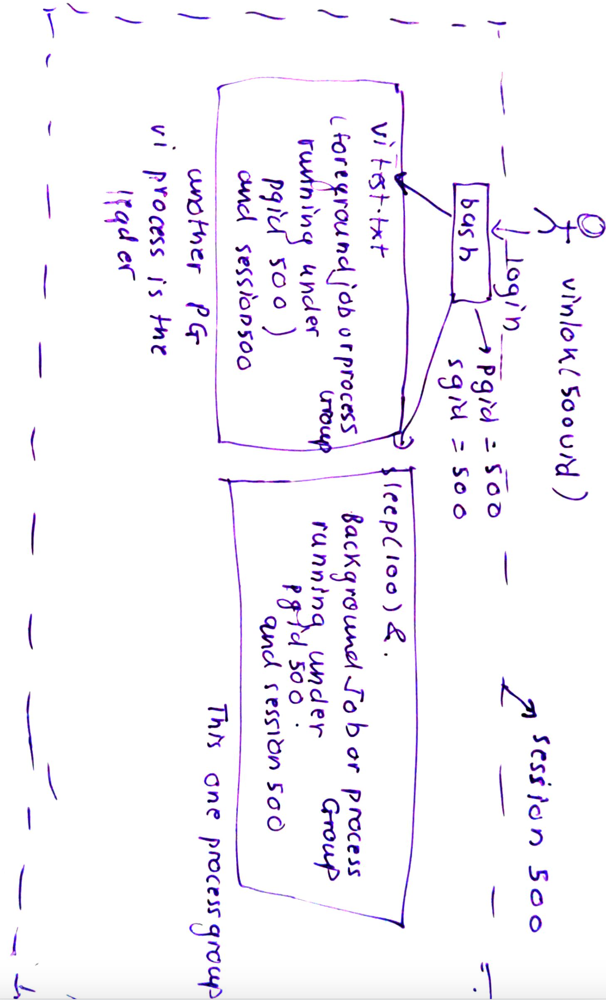
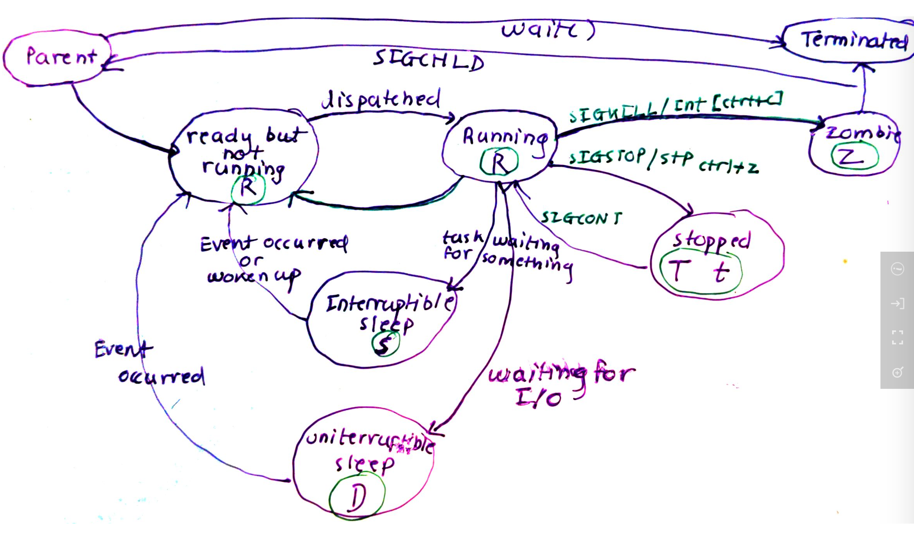
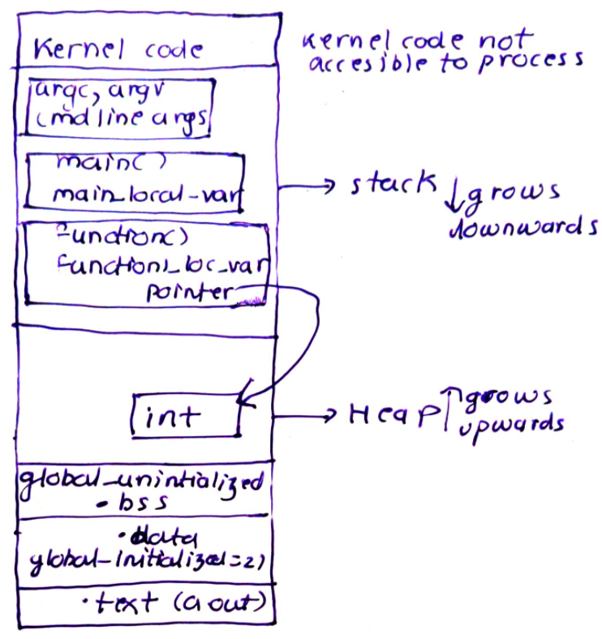
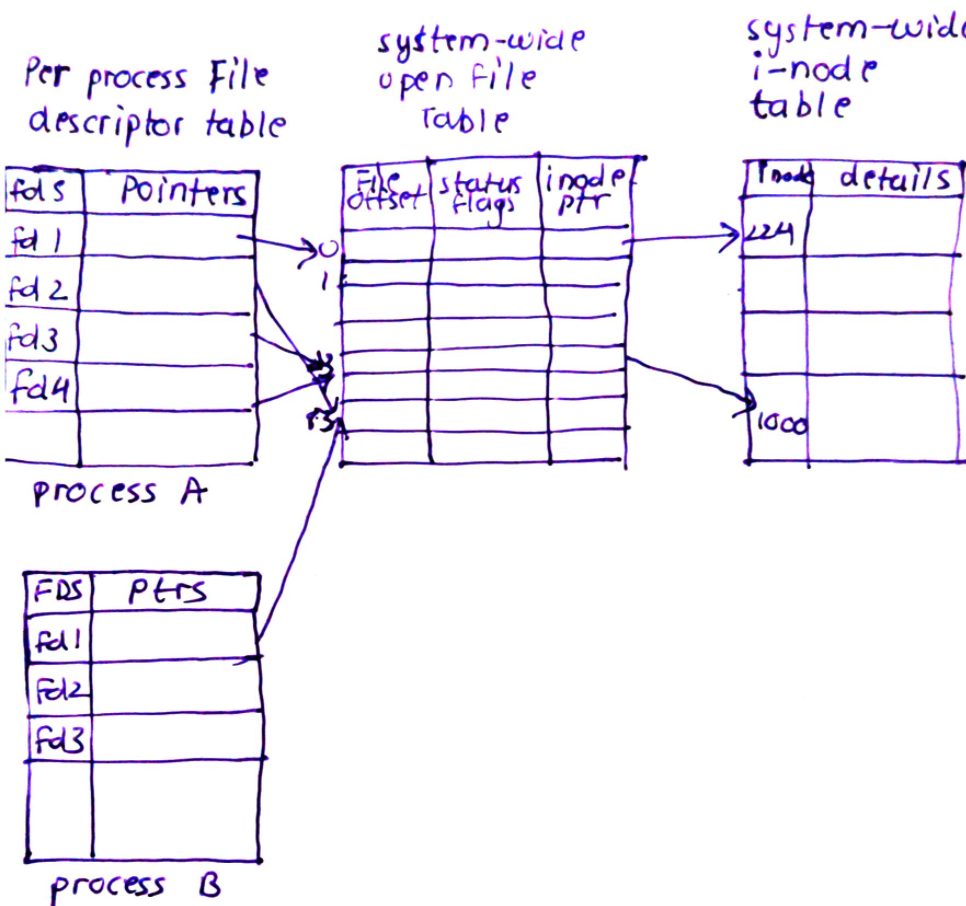
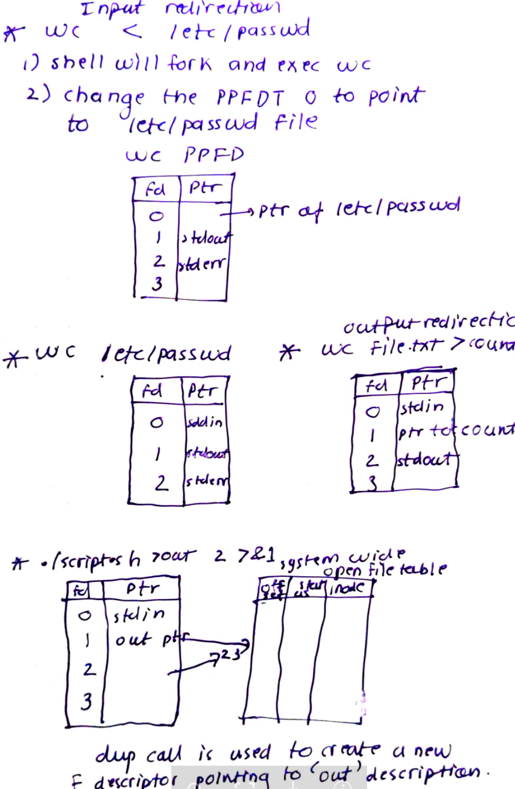
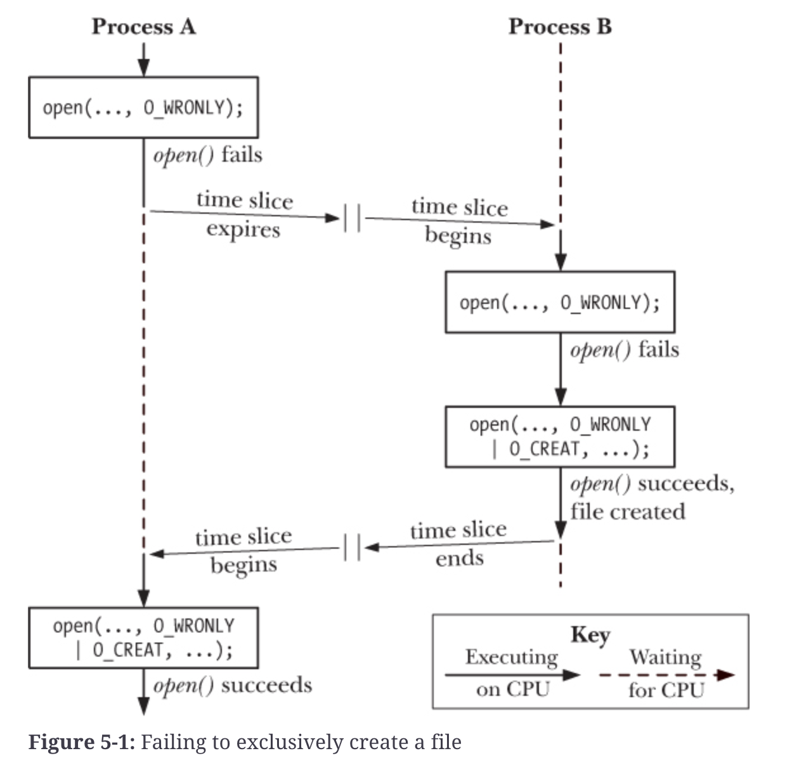

# Processes

- A process is instance of running program. 

- A program is a file containing information that describes how to construct a process at run time. It includes:
    - Binary Format Identification: a.out (Assembler Output), ELF
    - Machine-langauge instructions: The actual code of the program
    - Program entry-point address: Location of instruction to start execution
    - data: Initialized and uninitialized variables
    - Shared-Lib and dynamic linking info

<ELF digram here>

- Kernel stores list of running process in circular linker list and each element of LL is of type task_struct which is the process descriptor. This is usually 1.7 KB in size and contains all the information about a process . It defines:
    - Open files(PPFDT) -> files_struct
    - Memory mapping(page table) -> mm_struct
    - process state
    - signals(received, pending) -> signals_structs
    - PID: PID of process is unique positive integer which can be accessed using getpid(). Once max limit has reached, kernel starts at 300 as less than 300 is reserved for system processes and daemons.
    - PPID: Each PID has a PPID which can be found using getppid()
    - ownership (user and group owner): real-userid, effective-uid, 
    - process group ID
    - Priority
    - register values: These are the values which needs to be restored when a context switch happens.

- Inside kernel tasks/processes are referred via their task_struct. There is a macro in kernel CURRENT using which we can access the tast_struct of current running process. When kernel is doing some work for process, the process is said to be in process context.


- *Process Group*:
    - Each process is part of process group: child belong to same process groups as the parents. When shell starts a pipeline ls | wc -l here, ls and wc belongs to same process groups
    - Process groups makes it easy to send signal to group of interconnected processes.
    - process group is very closely related to job.
    - each process group is identified by pgid(process group id) and has a group leader and the pgid = pid of group leader.
    - When a user with UID 500 logs in, the bash is made as the leader of process group with pgid 500 and a new session is created with session id 500 
    - now when more process as launched, they all start with new process groups belonging to session id 500
    - When the users session finishes or user exits from session, all foreground jobs/process groups are sent SIGQUIT.
    - When network interupt is detected for shell, SIGHUP is sent all foreground process groups of a given session ID.
    - Ctrl+c send SIGINT to all foregroud process groups

    


# Process states



### Daemon process:
    - Started generally as root or as special user
    - It must be started as child of init and not connected to any terminal.
    
# Virtual Memory for processes
- The memory given to each user space process is called as process address space or virtual address space. It starts at 0 and goes all the way up to 2^32.

- A 32 bit addressing enable a process to address 2^32 addresses.

## Benefits
- Share memory (done via shmat)
- Use shared libaries
- Parent to child page sharing during fork()

# Memory Layout of a process
- 
- The process address space is divides in memory areas

Consider the following C code:

```
#include <stdio.h>

int global_initialized = 21;

int global_uninitialized;

int function1(){

    int function1_local_var;
    int *pointer = malloc(sizeof(int));
    free(pointer)

}

int main(int argc, char *argv[]){
    int main_local_var;

    func();
    return 0;
}

```

- You can also allocate memory in stack using alloca()
```
/* we want to duplicate 'song' */
char *dup;

dup = alloca (strlen (song) + 1);
strcpy (dup, song);

/* manipulate 'dup'... */

return; /* 'dup' is automatically freed */

```


The above code is compiled into ELF format described above and the memory map looks as below:




- The userstack grows and shrinks and functions are called an returned.
- The kerner-stack is per-process memory region maintained by kernel. This is used during the syscal execution. When library function executes trap, the kernel copies the registers(rdi...) to the kernel stack region of each process. 

## Heap

- Heap is present right after the uninitialized data segment in process memory map. 
- Heap is generally allocated using malloc()
- Malloc() function allocates size bytes from heap and returns pointer to the start of newly allocated block of memory. This block consists of pages. malloc return pointer of type void * which can be assigned to pointer of any c type.
- Free() function deallocates the memory block (or set of pages). It does not lower the program break (brk()) instead adds these block to list of available blocks.
- Next time when malloc requests for memory, it is given from these blocks if sufficient space is present.
- When a process starts, only the pages for .text, .data and .bss (zeroed pages for size of bss)


# Process task_struct to memory map to page table relation

- Each process is represented by task_struct which is stored at the end of kernel stack for the process.
- Task struct has pointer to the struct mm of process.
- mm contains details about processes memory areas and has point to pgd which is page global dir
- The pgd is essentially the page table for process.


# Process and files relation

- For each process, kernel maintains a **per process file descriptor table** which stores:
    - pointer open file table description

- Kernel also maintains a global system-wide open file descriptions table which stores:
    - open file description id (number)
    - offset location in file (usually lseek() or if previous write() or read() has done that)
    - file access mode; ro, w, append
    - pointer to i-node entry or (i-node number)

- Following diagram shows this:



- Here process A and B share the 83 global open file description. Hence, if process A changes the offset, process B will see the same.

- Fork() of a process will usually result in this scenario.


# I/O redirection

- Each process has a PPFDT which has three default descriptors:
 - 0 --> stdin
 - 1 --> stdout
 - 2 --> stderr



# Process Creation

## exec family of calls

    1. execl(*path, *arg, ...): Replaces current running process by the program pointed by path.
        - it is a variadic funtion which mean arguments can follow one by one terminated by NULL.
        - usually the pattern is:
        ```
        ret = execl("/bin/vi","vi","test.txt",NULL)

        ```
        - On success execl does not return because the current program is being replaces with the new one and execution jumps to the new.
        - On error -1 is set and perror() can be used to retrieve the error code.
        - Everything of the parent process except the following is changed:
            - pid, ppid, priority, user and group owner remains same.
        - ppfd is shared with new process. Thus it will have access to list of open files by the old process.
        - 

    2. execv(*path,array_containing_args)
        ```
        char *args[] = {"vi","test.txt",Null}
        execv("/bin/vi",args)
        ```

    

## fork()

- Fork() system call creates a new child process which is an almost exact copy of the parent.

- The parent and child will have same text. However, they will have their separate copies of .data, .bss, heap, stack and kernel_code sections.

- Thus each process can modify there own set of variables in stack and access the heap.

```
main(){
    pstack=2

    pid=fork()
    if pid==0:
        //In child
        pstack +=1
        // Now pstack will be 3
    else:
        // in parent
        pstack += 2
        // Now pstack will be 2 +4

    // both child and parent will come here
    print(pstack) here pstack will be 3 for child and 4 for parent 
}

```

- The child also receives duplicate copy of parent PPFD.

```
main(){
    fd=open()
    lseek(fd,100,cur)
    pid=fork()
    if pid==0:
        //In child
        lseek(fd,1000,cur)
        // now fd will be 1100
    else:
        // in parent
        wait()
        // Now pstack will be 2 +4

    // both child and parent will come here
    print(pstack) here pstack will be 3 for child and 4 for parent 
}
```

- fork is done as below:

```
int shared_var=1

pid = fork();

if pid == 0:
    // Then this is child
else:
    // this is parent
    // Do parenting, which is usually to wait() for child :)

//both process will return here and execute remaining program

```

- shell does fork and exec on new process.

- 

### *Copy on write - COW*

- When fork system call is executed, following steps occur:
    - New process with copy of parents .text, .data, .bss,heap and stack is created.
    - However, instead of copying the actual memory pages the pages as marked readonly and COW attribute is set in pagetable and TLB.
    - When the child tries writing to a given page, as it is readonly pagefault occurs indicating COW attribute.
    - Kernel then copies the page for the child, clears the COW attribute of old page and makes it writable.
    - The child would then continue using the new copy of page.

- As fork is usually followed by exec() which usually replaces the content of process memory map, COW saves the hassel of copying.

- vfork() suspends the parent process and uses its pages. Hence, child should not make changes to pages. usuall vfork() is followed with exec()
## exit(exit_status)

- no return value as there is no place to return.
- exit_status of 0 means success.
- On exit, the process open files are flushed.
- When process exits, SIGCHLD signal is sent to parent.

## zombie process
- When child dies before the parent, then the child is considered as zombie.
- This happens when the parent does not wait for child to finish or has not reaped the status of child using the wait() systemcall:

```

#include<stdio.h>


void main(){
int shared_var=1;
int pid = fork();


    printf("%d\n",getpid());

    if (pid == 0){
    // Then this is child
        printf("In child\n");
        printf("%d\n",getpid());
        }
    else{
        // this is parent
        // Do parenting, which is usually to wait() for child :)
        printf("In parent");
        printf("%d\n",getpid());
        sleep(10);
        }

//both process will return here and execute remaining program
}

```

- These are called as ghosts processes. Essentially if a parent forks a process and does not wait upon it, kernel keeps a skeleton on if just incase parent wants to see it later. 

- Incase the parent dies before waiting on zombie, init is made as its new parent and the it is waited upon by init.


# Atomicity and race conditions

Race condition: Result produced by two processes operating on a shared resources depends unexpectedly on the relative order of these process gaining access to CPU.



In this case O_WRONLY flags does not ensure if the file is already open by other process or not. Hence, it might lead to race condition.


# Context Switching
- Suspent the process by moving it to sleep state.
- Copy the contents of CPU registers to memory or the task_struct.
- copy back the context of new process from its task_struct to cpu registers.
- Flush TLB.