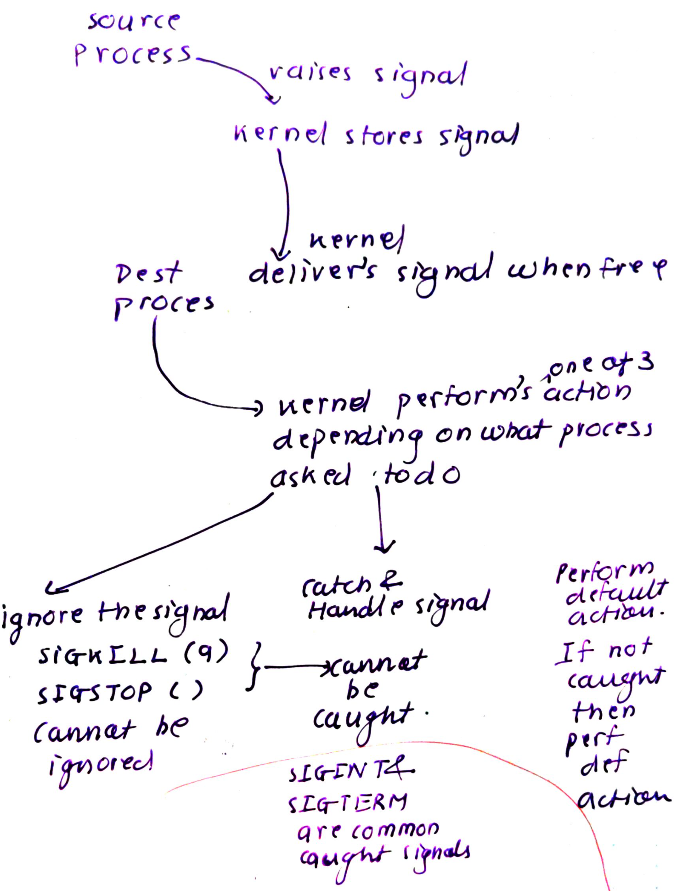

- Signals are also referred to as software interrupts. They are mechanism to notify a process of some event and interrupt their execution flow.

- Kernel sends signals to process for:
    - hardware exception: sigsegv, divide-by-zero
    - User issued ctrl-c or ctrl-z
    - Software event occured: input became avialable on FD, child of process terminated etc.

# Lifecycle of signals



# Signals
- There are total of 32 signals. man 7 signal has complete description

```
        Signal      Standard   Action   Comment
       ────────────────────────────────────────────────────────────────────────
       SIGABRT      P1990      Core    Abort signal from abort(3)
       SIGALRM      P1990      Term    Timer signal from alarm(2)
       SIGBUS       P2001      Core    Bus error (bad memory access). 
                                        mmap() might generate this
       SIGCHLD      P1990      Ign     Child stopped or terminated
                                        Kernel sends this to parent when process 
                                        stops or terminates.
                                        parent must catch this using wait() handler
       SIGHUP       P1990      Term    Hangup detected on controlling terminal
                                       or death of controlling process. 
                                       When terminal disconnects, kernel sends this
                                       to session leader. Also, this is sent to PG
                                       leader.
                                       Sometimes SIGHUP is used by daemon to reload
       SIGINT       P1990      Term    Interrupt from keyboard ctrl-c
       SIGKILL      P1990      Term    Kill signal. This cannot be caught by process
       SIGSTOP      P1990      Stop    Stop process. This cannot be caught by process

       SIGSTP                  Stop    Send this signal to all foregroud processes 
                                       group when suspend char is pressed: ctrl + Z

       SIGQUIT      P1990      Core    Quit from keyboard. For foregroud process. 
                                       ctrl +\ in telnet does this.

       SIGSEGV      P1990      Core    Invalid memory reference. When malloc trying
                                        to access invalid or mprotected

       SIGTERM      P1990      Term    Termination signal. Graceful termination. 
                                        only can be sent by kill. Can be caught
                                        but usually not.

       SIGSYS       P2001      Core    Bad system call (SVr4);
                                       see also seccomp(2) 

       SIGCONT      P1990      Cont    Continue if stopped

       SIGFPE       P1990      Core    Floating-point exception

       SIGWINCH                         Sent to foregroud process group when terminal
                                         resized top() uses it
       SIGTRAP      P2001      Core    Trace/breakpoint trap
       SIGUSR1      P1990      Term    User-defined signal 1
       SIGUSR2      P1990      Term    User-defined signal 2
```


# Catching signal

- Done using signal() system call.
- SIGKILL and SIGSTOP cannot be caught.
- steps:
    1. Create the signal handler function.
    2. Register the signal handler function using signal() syscal.
- Example:
```
#include <stdlib.h>
#include <stdio.h>
#include <unistd.h>
#include <signal.h>

/* handler for SIGINT */
static void sigint_handler (int signo)
{
        /*
         * Technically, you shouldn't use printf() in a
         * signal handler, but it isn't the end of the
         * world. I'll discuss why in the section
         * "Reentrancy."
         */
        printf ("Caught SIGINT!\n");
        exit (EXIT_SUCCESS);
}

int main (void)
{
        /*
         * Register sigint_handler as our signal handler
         * for SIGINT.
         */
        if (signal (SIGINT, sigint_handler) == SIG_ERR) {
                fprintf (stderr, "Cannot handle SIGINT!\n");
                exit (EXIT_FAILURE);
        }

        for (;;)
                pause ();

        return 0;
}

```

# fork and exec effect on signals

- forking a child inherits signal actions of parent. But pending signals are not inherited
- exec would reset all signals to default as the memory of new process is done from scrach. Hence, the registered signals are not shared.

# sending signal from one process to other

- done via kill() system call: kill(pid,signo)
- if pid = 0, then send to current processes group  
    if pid < -1, send it to -pid process group
    else send to pid

- root has CAP_KILL and send signals to any process

# sending signal to self
- raise(signo)

# Reentrancy

- Signal handler must be written with utmost care as they might return to process doing something critical.
- abort(), accept() etc are guaranteed safe reentrant functions.

# Blocking Signals

- During the programs critical regions, signals might need to be blocked/masked. Again SIGKILL and SIGSTOP cannot be blocked.
- when a kernel raises a signal which is blocked by process, it is called as pending.
- Process can retrieve set of pending signals.