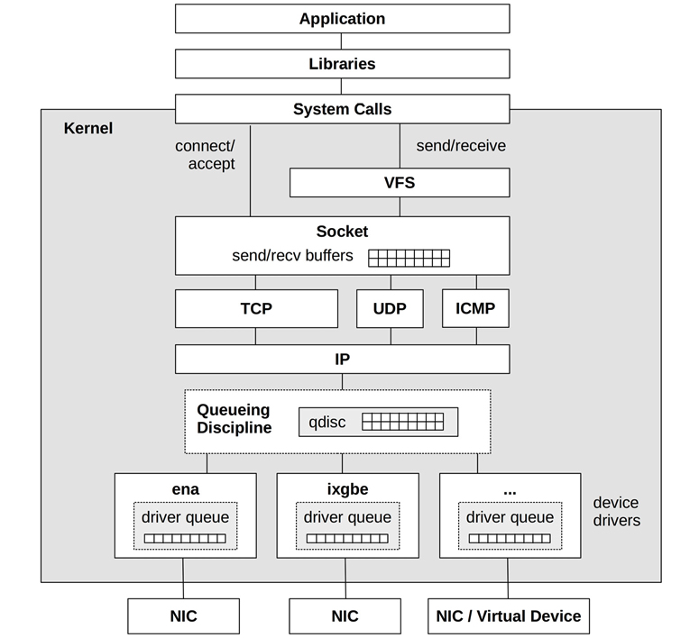

# Networking

## TCP/IP vs OSI Layer


# Misc

- TCP/IP packets size is generally between 54 to 9054.
- Packet size is determined by the network also referred as MTU which is often 1500 bytes (MTU)
- Jumbo frames are also supported by networks with packet size upto 9000 Bytes.
- Connection Latency: It is the TCP handshake time needed that is time lapsed when a syn is sent and a syn-ack is received.
- Connection Backlog: 
    SYN requests can be queued at the Kernel level befor being accepted by the user-land process. When the backlog reaches a limit, the connections are droped.

    Backlog drops and SYN retransmits are indicators of host overload.

- Measuring Utilization: Current througput / bandwidth 

- IPC can happen over localhost/loopback.


# Sliding Window

Sliding window: This allows multiple packets up to the size of the
window to be sent on the network before acknowledgments are received,
providing high throughput even on high-latency networks. The size of
the window is advertised by the receiver to indicate how many packets it
is willing to receive at that time


# Networking arch in Linux




# TCP Buffering

Data throuput is improved by using send and receive buffers:


# Troubleshooting

## netstat
 1. netstat -i

 ```
 root@vinlok-ThinkPad-T400:~# netstat -i
Kernel Interface table
Iface      MTU    RX-OK RX-ERR RX-DRP RX-OVR    TX-OK TX-ERR TX-DRP TX-OVR Flg
enp0s25   1500        0      0      0 0             0      0      0      0 BMU
lo       65536     6885      0      0 0          6885      0      0      0 LRU
wlp3s0    1500   702630      0      0 0        287609      0      0      0 BMRU
```

2. Traceroute -T

3. ping :
    -s 
    -t
    -v

## Kernel Params to tune

net.core.default_qdisc = fq
net.core.netdev_max_backlog = 5000
net.core.rmem_max = 16777216
net.core.somaxconn = 1024
net.core.wmem_max = 16777216
net.ipv4.ip_local_port_range = 10240 65535
net.ipv4.tcp_abort_on_overflow = 1
net.ipv4.tcp_congestion_control = bbr
net.ipv4.tcp_max_syn_backlog = 8192
net.ipv4.tcp_rmem = 4096 12582912 16777216
net.ipv4.tcp_slow_start_after_idle = 0
net.ipv4.tcp_syn_retries = 2
net.ipv4.tcp_tw_reuse = 1
net.ipv4.tcp_wmem = 4096 12582912 16777216

- TCP Backlog
First backlog queue, for half-open connections:
net.ipv4.tcp_max_syn_backlog = 4096
- Second backlog queue, the listen backlog, for passing
connections to accept(2):
net.core.somaxconn = 1024
Both of these may need to be increased from their defaults, for
example, to 4,096 and 1,024, or higher, to better handle bursts
of load.

- TCP Options
Other TCP parameters that may be set include:
```
net.ipv4.tcp_sack = 1
net.ipv4.tcp_fack = 1
net.ipv4.tcp_tw_reuse = 1
net.ipv4.tcp_tw_recycle = 0
```
SACK and the FACK extensions may improve throughput
performance over high-latency networks, at the cost of some
CPU load.

The tcp_tw_reuse tunable allows a TIME_WAIT session
to be reused when it appears safe to do so. This can allow
higher rates of connections between two hosts, such as
between a web server and a database, without hitting the 16-bit
ephemeral port limit with sessions in TIME_WAIT.
tcp_tw_recycle is another way to reuse TIME_WAIT
sessions, although not as safe as tcp_tw_reuse.


