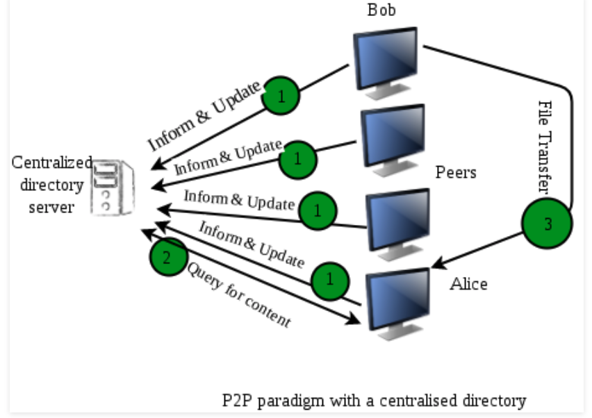
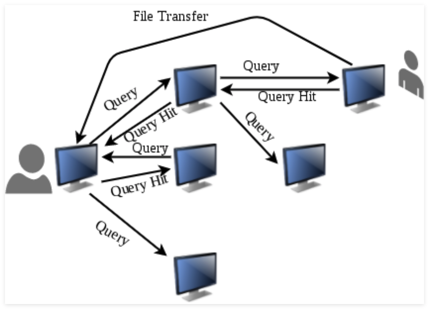
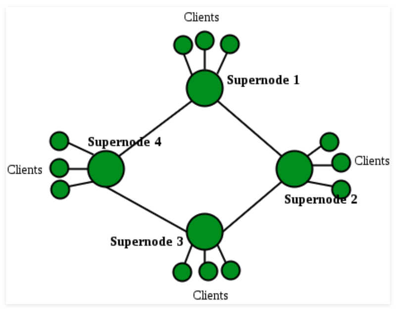
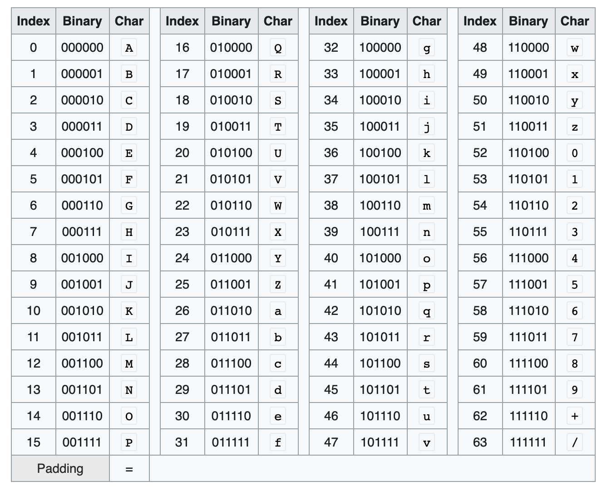
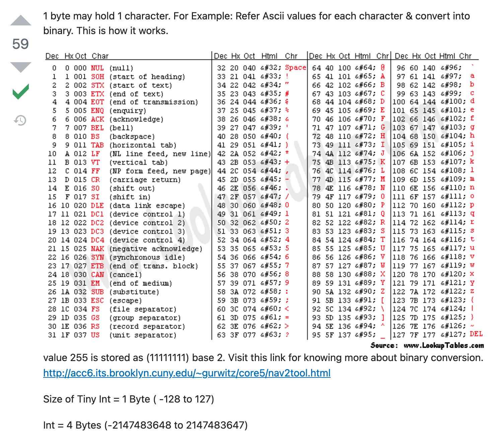

Systems design misc

# Proxies

## Forward proxies:
    - proxy is often used here.
    - It is a server that sits between client and server and acts on behalf of the clients.
    - Communication:
        - client to proxy to server
        - server to proxy to client

    Both side communication goes via proxy.

    - It essentially masks the identity of the client (x-forward-ip)
    - VPN can be though of a forward proxy.

## Reverse Proxy

    - They act on behalf of server.
    - Communication:
        - client to proxy to server
        - server to proxy to client

    - This is what is used in loadbalancer. 
    - The AWS Loadbalancers are reverse proxy servers.
    - You can add rules, log requests coming to your servers.

# Load Balancers


# Peer to peer network

Can be done in three ways:

1. Centralised tracker



2. Gossip protocal (query flooding)



3. Supernodes



# Polling and streaming

- Polling : Client requests for data every x seconds. Example: Poll for new data every 1 minute. Not good for apps where you need instant access.
    - This is a pull mechanism.
    - Periodic checks needs polling, like refresh of dashboard every 1 min or so.
- Streaming: Client opens a socket with servers. Websockets is example of this. These are the long lived connections and listen to the server for any new data from the server.
    - This is push mechanism from server.
    - The server implements the business logic of when to push the data.
    - If data needs to be pushed realtime, then streaming should be used, like chat.


# Configuration
- Use of configuration files such as JSON or YAML is encouraged.
- Types:
    - Static: Packaged with the application. When this is changed, the application needs to be redeployed.
    - Dynamic: Often backed by database or feature flags. Since these are not packaged with app and does not need deployment, there has to be special review process restrictly only certain set of users. With great power comes great responsibility.


# Rate Limiting
- Often proxies are used for implementing rate limiting.
- Used to prevent DoS (Denial of Service) attack. 
- You can use cache (redis) which tracks number of request by client/ip etc. This way all servers can be centralized.

# Logging and monitoring
- Logging: Debugging and analytics. JSON format for logs.
- 

# Pub/Sub
- Used for async jobs. Client publishes a jobs, server picks it up, perform the operation and send back to the client.
- There are four entities/part/players:
    - Publisher: Clients publish messages to Topic
    - Subscliber: These are systems which are listening to Topic with for new message.
    - Topic: These are nothing but channels/containers.
    - Messages: data which needs to be shared between pub and sub.

- Topics are persistent, ordered (depends on implementation).
- Example: SQS queue, SNS.
- Idempotent operation: Operation which can be done multiple times. Pub sub systems can deliver messages more than once. They gurantee at-least-once delivery. Hence, the message stored in topics should usually be idempotent. Example: status (complete). Do not use for increasing something.
- You can also replay the messages from topics.
- Usually it is good idea to create separate topic for each type of data.

# MapReduce
Example: Could number of words in files distributed across 100 matchines
- Map step: One each machine, we will create a map for word:count. This can be part of the same file or separate file per word (this is good idea)
- Shuffle step: Once the map has been created, in the shuffle stage, we move all the files for given words together.
- Reduce step: Once we have files for a given word from all the workers, then we reduce them result.


# HTTPS


# CRUD
- Create
- Read
- Update
- Delete


# Base64 encoding

- Base 64 encoding means 2^6. Hence, you need 6 bits to represnt 64 values.
- If we take a-z,A-Z=26+26=52, 0-9=10, /+ then we get 64 values.



- MD5 hash is 128 Bit long. Thus, if we group it into 6 bits, we need 128/6 = 21 chars of base64 encoding to represent it.== will be used for pading.


# Bloom Filter

A Bloom filter is a space-efficient probabilistic data structure that is used to test whether an element is a member of a set. For example, checking availability of username is set membership problem, where the set is the list of all registered username. The price we pay for efficiency is that it is probabilistic in nature that means, there might be some False Positive results. False positive means, it might tell that given username is already taken but actually it’s not.
Interesting Properties of Bloom Filters  

Unlike a standard hash table, a Bloom filter of a fixed size can represent a set with an arbitrarily large number of elements.
Adding an element never fails. However, the false positive rate increases steadily as elements are added until all bits in the filter are set to 1, at which point all queries yield a positive result.
Bloom filters never generate false negative result, i.e., telling you that a username doesn’t exist when it actually exists.
Deleting elements from filter is not possible because, if we delete a single element by clearing bits at indices generated by k hash functions, it might cause deletion of few other elements. Example – if we delete “geeks” (in given example below) by clearing bit at 1, 4 and 7, we might end up deleting “nerd” also Because bit at index 4 becomes 0 and bloom filter claims that “nerd” is not present.

Reference: https://www.geeksforgeeks.org/bloom-filters-introduction-and-python-implementation/


# Cache

## Redis
    - string (key:value)
    - list : Implementent as linked list. O(1) for add/remove but O(n) for accessing
    - sorted set: zstore.
        - adding
        ```
        store_name="vinstore"
        data={"id":"werwer","latency":916,"code":500,"path":"/something/sometext}
        score=916
        redisClient.zadd(store_name,{json.dumps(data):score})
        ```
        - retrieving:
            store="vinstore"
            redisClient.zrange(store, 0, -1, desc=True, withscores=True)


# ASCII and character size



- There are 128 charaters in ASCII. Thus, you need 2^8 numbers to represent
- Thus, you need a byte to represent all ASCII char.


# Client server communication techniques:
## Polling
    1. The client opens a connection and requests data from the server using regular HTTP.
    2. The requested webpage sends requests to the server at regular intervals (e.g., 0.5 seconds).
    3. The server calculates the response and sends it back, just like regular HTTP traffic.
    4. The client repeats the above three steps periodically to get updates from the server

## Long Polling
    - Also called has hanging Get.
    - Step 1 same as polling.
    - Step 2, server does not respond untill there is some data to send.
    - Step 3, sends data when available
    - Repeat

## Websockets
    - Just like sockets.

## SSE - Server Sent Events
    - step 1 same
    - Sever keeps this as persistent connection and send data to client via this.
    - For client to send data, it has to open new connection.

# Guidelines for designing 

1. Choose multiple datacenters or backends. Atleast 3.
2. Write synchronously: This is what cassandra does using Quorum.
3. Automate the failover. Example, if the local writes are slow, move to remote writes.
4. 