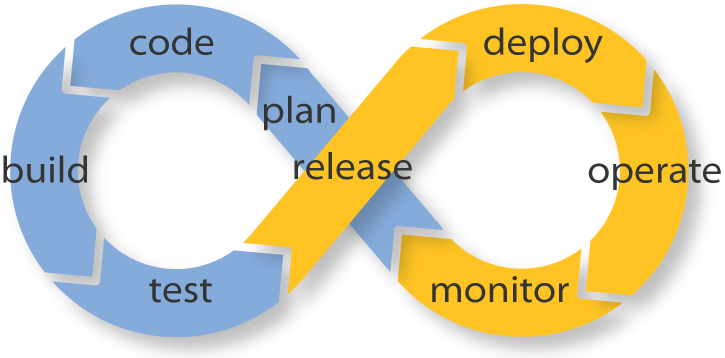

<table id="t02" style="margin-top:250px;margin-bottom:50px;margin-left:0px;">
                <tr>
                	<td style="border-right: 4px solid #f1f1f1;"> 
                		
                	</td>
                	<td  style="text-align:left;border-right: 4px solid #f1f1f1;"> 
                		<ul class="a">
  							<li>Plan assuming cloud components will fail!</li>
 							<li>Code in small batches</li>
  							<li>Build with Continuous Integration</li>
  							<li>Test till you uncover a bug!</li>
  							<li>Release and deploy with Contunuous Deployment</li>
  							<li>Operate as if you are flying an airplane!</li>
  							<li>Monitor proactively keeping customers in mind</li>
						</ul>
                	</td>
                	<td>
                		

                    		
 One machine can do the work of fifty ordinary men.  No machine can do the work of one extraordinary man.   - Elbert Hubbard    

                    		
 Technology is a word that describes something that doesn’t work yet.    - Douglas Adams     

                    		
 The real danger is not that computers will begin to think like men, but that men will begin to think like computers.   - Sydney Harris    

                    		
 Man is a tool-making animal.   - Benjamin Franklin    

                    		
 Treat your password like your toothbrush. Don't let anybody else use it, and get a new one every six months.   - Clifford Stoll  

                    		
 Everything is theoretically impossible, until it is done.   - Robert A. Heinlein   

						

                	</td>
                	
                </tr>
		</table>